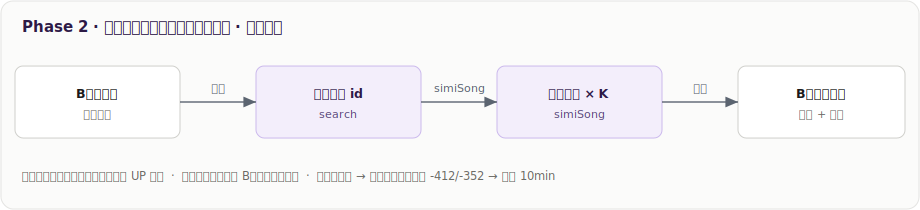
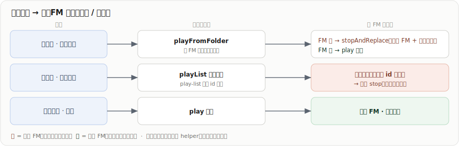
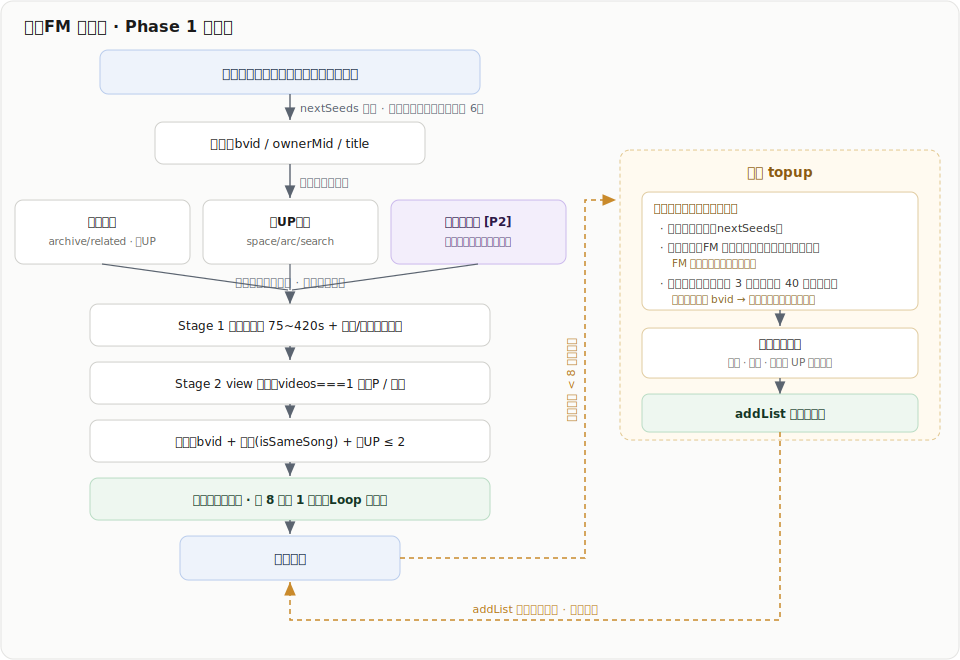
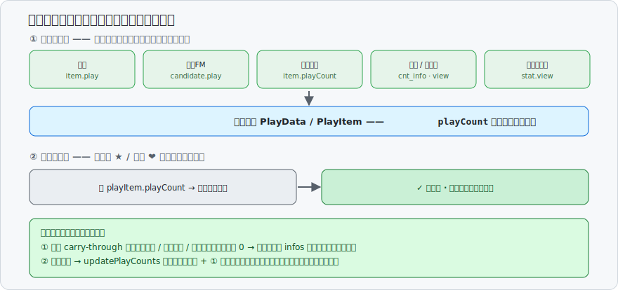

# 开发日志（DEVLOG）

> **格式约定**
>
> - 每次提交前记一条：写清**这个提交做了什么、效果是什么、数据流怎么走**，让开发者扫一眼就懂，而不是复述 diff。
> - **同一功能的多次提交归到同一个二级标题（`##`）下**，各次改动用三级标题（`### 日期 type: 概述`）；同分类内**新的在上**。
> - **无需分类的单次改动**（如纯文档、杂项）直接作为二级标题（`##`）。
> - **简单改动效果足以看懂，不必展开**；**复杂功能必须配图**（数据流 / 架构），SVG 放 `docs/devlog-assets/` 并在正文引用。
> - **坑 / 反复权衡的设计决策不写这里**，归到 `docs/ideas/` 对应的 idea 文件。

## 私人FM / 心动模式

> 网易云「心动模式」的复刻：从默认「我喜欢的音乐」红心歌单取种子 → 找相似**单曲** → 与红心歌交织、无限续供。
> 核心认知：网易的「相似」本质是靠海量听歌行为算好的一张**协同过滤预计算查表**——那张表我们造不出，
> 但能先用 B站原生信号自己凑一版（Phase 1），再把网易那张表当**第三条腿**借过来（Phase 2）。

### 2026-07-15 feat: 私人FM 完善（接入网易相似表 · 切走时机 · 续供重构）

一次提交，三块：

**① feat 接入网易相似表**：候选引擎加第三条腿——网易 `simiSong` 相似歌表（IPC 五件套 `electron/ipc/api/netease-simi.ts` + `service/heartbeat/netease-similar.ts`）。候选池多了「同曲风、异歌手」跨界推荐，**默认开、无开关、失败静默、撞风控熔断**，整条挂掉只退回原效果。数据流：两道模糊匹配——去程（B站脏标题 → 网易曲目 id）+ 回程（相似歌名 → 回搜 B站单曲），排候选池最前、软超时兜底。



**② fix 完善切走私人 FM 时机**：合集 / 系列两页的单曲点击接上「结束 FM + 整队替换成该歌单」，收口进 `service/heartbeat/play-from-folder.ts` 的 `playFromFolder`。数据流：单曲点击走 `playFromFolder`（按 FM 是否进行中分流）；「播放全部」靠续供订阅的会话 id 兜底自动停；全网搜索点歌仍插播、保留 FM。分P 无碍（各 item 自带其 P，按点击项旋转起点）。



**③ feat 重构续供推荐歌曲功能**：续供的二度扩展种子，从「随机抽 FM 自产候选」改成「你在 FM 里收藏过的 FM 推荐歌」（`noteFavoriteFromFm` 双门槛：FM 播放中 + 收藏的歌在 `servedBvids` 里），持久化 `HeartbeatFavSeeds`；不够 3 个再从最近已推随机补齐。强正反馈闭环——FM 推、你收藏、再顺着找同类，不再漂。数据流见下方主管线图「续供 topup」面板。

### 2026-07-08 chore: 暂存

**做了什么**：仿网易云「心动模式」——从默认红心歌单取种子，用 B站原生信号找相似**单曲**，与红心歌交织、无限续供。侧栏新增「私人FM」入口 → `/heartbeat`。

**效果**：

1. **进入即自动开始播放，在播的也会被打断**。
2. 默认存在一个**不可删**的本地歌单「我喜欢的音乐」（`LIKED_FOLDER_ID = -1`），是主种子源；红心按钮把当前歌加入 / 移出它。
3. 「正在播放」卡片页：⏮上一首 / ⏯播放暂停 / ⏭下一首 / ❤️红心。红心歌跳过不算负反馈，非红心歌跳过才算。
4. **跨会话 / 跨天不重复推**：滚动记住最近 800 首已推历史，下次开 FM 自动排除。

**数据流**：红心种子（轮转覆盖全部）→ 三腿取候选（看了又看 + 同 UP，Phase 2 再加网易腿）→ 两段净化 + 去重（排除近 800 首已推）→ 交织（相似打底、插红心）→ 播放队列 → 快播完时续供（续供种子 ＝ 红心轮转 + 你在 FM 里收藏的推荐歌当二度扩展，不够则从最近已推随机补齐）。



## 2026-07-13 fix: 本地歌单部分歌曲播放量显示「-」



**效果**：
1. 之前：从**播放栏星标 / 心动模式**收藏进本地歌单（如「我喜欢的音乐」）的歌，播放量一律显示「-」。
2. 现在：播放量**随歌曲一路带进播放队列**，收藏时直接沿用、**零额外请求**；个别没带到的来源异步回查一次兜底，打开歌单时再兜底补历史遗留数据。列表正常显示（如 15.1 万 / 1.2 万）。

**根因**（不是年份问题，是「播放队列把播放量丢了」）：
播放队列的 `PlayData` / `PlayItem` 类型**原本没有 `playCount` 字段**。所以哪怕搜索结果本来带着播放量，歌一进播放队列这个数就被丢掉；播放栏星标 / 心动读的是队列里的 `PlayItem`，自然拿不到，存进本地歌单就是 `undefined` → 列表按「>0 才显示，否则「-」」渲染成「-」。**不是 B 站没给，是自己的队列模型没那个槽。**

判据（翻本机存储直接可见）：`%USERPROFILE%\Documents\Biu\local-fav-items.json` 里 `source:"online"` 的项 `playCount` 全是 `null`，而从收藏夹 / 搜索页**用条目菜单**收藏的老数据 `playCount` 都正常（那条路径本来就带了播放量）。

**修法**（三层，优先级从高到低）：

**① carry-through（主，零请求）**：给 `PlayData` / `PlayItem` 加 `playCount` 字段，各播放来源构造播放项时就把播放量填进去——数据本来就在手：搜索结果 `item.play`、私人FM 候选 `SongCandidate.play`、本地歌单 `LocalFavItem.playCount`、B 站收藏夹 `cnt_info`、`getMVData` 回查元数据时顺带的 `stat.view`。收藏时 `MusicFavButton` / 心动直接读 `playItem.playCount` 存下。**私人FM 请求本来就密，这条尤其关键**——避免每次点 ❤️ 再多打一次 infos。

```ts
// store/heartbeat.ts - candToPlayItem()：私人FM 候选把 play 带进播放项
playCount: c.play,
// store/play-list.ts - getMVData()：元数据回查本就拉了 stat，顺手带上
playCount: res?.data?.stat?.view,
// components/music-fav-button：收藏时直接沿用，不再回查
itemInfo: { /* … */ playCount: playItem.playCount },
```

**② 收藏当场兜底**：**没接 carry-through 的播放入口**（历史记录 / 稍后再看 / 动态 / 投稿 / 合集等）或**来源字段本身为 0** 的项，`addOnlineItemToLocalFav` 立刻入库 + 异步回查一次 `infos` 补上。注意 `infos` 是**另一条接口**、不是重试同一份数据——收藏夹**列表**接口 `play=0` 时它照样能返回真实播放量（这正是本 bug 最初成因），所以「没带到时查 infos 也白查」不成立。（`getMVData` 已覆盖「裸 bvid 缺元数据」这类，走的是 ①，不到 ②。）

**③ 打开歌单兜底**：补历史遗留数据（本次改动前存下的 `null`）+ ② 回查失败（私密/删除/限流）的重试。搭「失效检测」的顺风车批量取播放量，零额外请求。

配套：`fav-resource-infos` 的 `cnt_info` 补 `vt?` 字段；`fillFavMediaPlayCount`（B 站收藏夹页）也改成 `resolvePlayCount(play, vt)` 两者都认。

与 B 站收藏夹页那条 `play=0` 的区别：那条是**列表接口自身**返回 0；这条是**本地队列没带 / 快照没存**。

## 2026-07-10 refactor: 重构标签筛选设计

**效果**：
1. 展开的标签浮层宽度与「标签」按钮对齐（原来是固定 252px 的浮层）。
2. 去掉每个标签右侧的全局数量。
3. 标签列表改为**只展示当前歌单内出现过的标签**——原来列出全部全局标签，2 首歌的歌单也会冒出「动漫 89 / 日系 133」等无关项；筛选本就作用于歌单内部，现在标签列表与筛选范围一致了。

**关键点**：
- **浮层同宽**：展开前量一次触发按钮的 `offsetWidth`，作为浮层 `width`。HeroUI 的 `PopoverTrigger` 内部用 `mergeRefs` 合并 ref，所以给 `Button` 挂自己的 ref 量宽度不会影响它的定位逻辑。
- **歌单内标签**：各歌单页算出 `availableTagIds`（= 歌单条目用到的标签 ∪ 当前已选）传入浮层。已选标签即便被移出歌单也保留在列表里，避免「筛完了却清不掉」；切换歌单时重置筛选，防止选择串到别的歌单。

## 2026-07-09 docs: 新增 AI_GUIDELINES.md + DEVLOG.md

**效果**：
1. 项目根目录新增两份持续维护的文档——[`AI_GUIDELINES.md`](./AI_GUIDELINES.md)（AI 生成规范 / 错题本）和本文件 `DEVLOG.md`（开发日志）。
2. 之后 AI 生成代码有明确的规范要求与避坑指南，且每次提交前都需要在本文件对改动做白盒记录。
