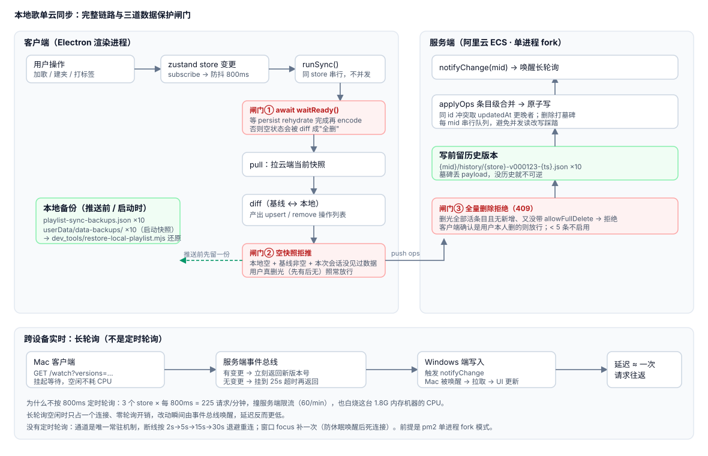

# 开发日志（DEVLOG）

> **格式约定**
>
> - 每次提交前记一条：写清**这个提交做了什么、效果是什么、数据流怎么走**，让开发者扫一眼就懂，而不是复述 diff。
> - **同一功能的多次提交归到同一个二级标题（`##`）下**，各次改动用三级标题（`### 日期 type: 概述`）；同分类内**新的在上**。
> - **无需分类的单次改动**（如纯文档、杂项）直接作为二级标题（`##`）。
> - **简单改动效果足以看懂，不必展开**；**复杂功能必须配图**（数据流 / 架构），SVG 放 `docs/devlog-assets/` 并在正文引用。
> - **坑 / 反复权衡的设计决策不写这里**，归到 `docs/ideas/` 对应的 idea 文件。

## 开发工具与性能

### 2026-08-08 perf(eslint): 避免全仓检查扫描生成文件

**效果**：

1. 全仓 ESLint 不再扫描服务端 `dist`、嵌套 `node_modules` 与 Android 构建产物，避免生成文件把一次检查拖成长期高 CPU 进程。
2. 编辑器 ESLint 改为保存时检查，并固定在仓库根目录解析配置，减少持续检查与子目录重复解析。

**关键配置**：

1. [`eslint.config.mjs`](./eslint.config.mjs) 使用全局忽略规则覆盖所有层级的 `dist` / `node_modules` 和 `android` 生成目录；源码目录仍按原规则检查。
2. [`.vscode/settings.json`](./.vscode/settings.json) 设置 `eslint.run: onSave` 与根目录工作目录；不改变手动 `pnpm exec eslint` 的使用方式。

**验证**：同一条 `pnpm exec eslint .` 从修改前约 2 分 48 秒降至约 6.3 秒；生成文件直接检查会被忽略，命令结束后无 ESLint 常驻进程。

## 本地歌单收藏

### 2026-08-07 fix(favorite): 本地歌单分P二次收藏沿用原条目


**效果**：

1. 从本地歌单条目的“移动”菜单再次收藏时，直接进入本地歌单选择，不再弹出整稿分P列表；源歌单会按当前条目状态预选。
2. 分P条目使用已保存的 `rid/cid` 做身份匹配，不依赖歌名；复制到另一个本地歌单时保留用户已经修改过的标题、分集序号、分集标题和时长，不再自动追加 `-P32`。
3. 搜索、合集、播放栏等全网收藏入口不带本地来源标记，仍保留原来的 B 站分P选择和在线收藏逻辑。

**关键数据流**：

1. [`src/common/utils/fav.ts`](src/common/utils/fav.ts) 的 `toLocalFavoriteModalData` 将本地条目的 `rid/cid/title/page/partTitle` 与 `fromLocalFavorite` 一起传给弹窗；`source` 同时补齐，避免本地文件二次收藏丢失播放来源。
2. [`src/components/favorites-select-modal/index.tsx`](src/components/favorites-select-modal/index.tsx) 看到 `fromLocalFavorite` 后跳过 `getWebInterfaceView` 和 B 站收藏夹列表请求，只计算本地歌单的选中状态；`resolveLocalFavoriteSelection` 以原 cid 为 `localRid`，直接使用原标题。
3. [`src/pages/video-collection/local-favorites/index.tsx`](src/pages/video-collection/local-favorites/index.tsx) 的“移动”入口统一走上述本地数据转换；目标歌单仍通过 `addOnlineItemToLocalFav` 入库，因此与普通收藏共享持久化、标签和播放量补全路径。

**验证**：新增 `tests/local-fav-duplicate.test.ts` 覆盖分P身份/标题保留及普通整稿收藏不误带 cid 两条边界。

## 2026-08-04 fix: 播放栏 / 歌单封面不同步

**效果**：

1、合集里点一首歌，播放栏的标题和封面现在始终和你点的这首对得上；

2、本地歌单封面（详情页头图、左侧栏缩略图）始终和歌单里最新收藏的那首歌封面一致，增删歌曲后会自动跟着换。

**关键代码**：

1. [`src/store/play-list.ts`](src/store/play-list.ts) `play()`：以前一首歌如果已经在播放队列里（比如之前在收藏夹改过名字），再从别处点它，只会切换播放，不会把新的标题/封面写回去，导致播放栏显示的还是旧的。现在复用队列里的曲目时，同步把标题封面刷新成这次点击的最新值。
2. [`src/common/utils/fav.ts`](src/common/utils/fav.ts) 新增 `getLocalFolderLatestCover`，取歌单里收藏时间最新那首歌的封面；[`local-favorites/index.tsx`](src/pages/video-collection/local-favorites/index.tsx) 的详情页头图、[`layout/side/collection/index.tsx`](src/layout/side/collection/index.tsx) 的左侧栏缩略图都改用这个实时值，不再读创建/迁移时写死的 `folder.cover`。

## 2026-08-04 fix: 部分歌曲「失效」误判


**效果**：本地收藏夹里部分实际正常可播的视频被错误打上「失效」角标（灰显 + 红框），例如 `BV1Xx411c7Dm` 在 B 站网页端能正常播放，App 里却显示失效。

**根因**：`/x/v3/fav/resource/infos` 的 `attr` 字段实测是**位掩码**，不是文档写的「0:正常 1:失效」二元值——直接查该接口拿到 `attr: 4`，第 0 位（`attr & 1`）是 0，视频本身完全正常；旧代码却按 `attr !== 0` 整体判定失效，把第 2 位这种无关标记（分P/推广等，含义未知）也当成了失效信号，一起误杀。另外接口对部分资源（尤其老视频）批量查询时可能整条不返回，旧代码把「不在有效集合里」直接等同「已失效」，把接口偶发缺席也算成了永久失效。

**关键代码**：

```ts
// src/common/utils/fav.ts —— detectInvalidLocalFavItems
// attr 是位掩码：仅第 0 位表示已失效，其余位是分P/推广等无关标记
const returnedKeys = new Set(infos.map(info => `${info.id}:${info.type}`));
const invalidKeys = new Set(infos.filter(info => (info.attr & 1) === 1).map(info => `${info.id}:${info.type}`));
for (const key of chunks[i]) {
  if (!returnedKeys.has(key)) continue; // 接口没返回：本轮不计入 checked，留到下次重新打开收藏夹再判
  for (const rid of resourceToRids.get(key) ?? []) {
    checked.add(rid);
    if (invalidKeys.has(key)) invalid.add(rid); // 只有明确返回且第 0 位为 1 才判失效
  }
}
```

`fetchLocalFavPlayCount`（单项播放量回查）、`getAllFavMedia`（在线收藏夹播放全部）两处同样把 `attr === 0` 的写法改成 `(attr & 1) === 0`，判断口径统一。`src/service/fav-resource-infos.ts` 里 `attr` 字段的过时注释也一并更正。之前被误标的本地数据不用手动改——下次打开对应收藏夹，后台重新检测会自动清除旧的错误 `invalid` 标记。

## 本地歌单云同步

### 2026-08-04 perf: 一次操作只发一个请求

**效果**：一次用户操作的请求数从约 17 降到 **1~2**；空闲时每设备约 **1.2 次/分钟**。为多用户并发留出余量——限流是自家服务端的 `express-rate-limit`（按 mid），跟 B 站无关，同步全程不碰 B 站接口。

**省掉的三处**：

1. **推送前那次拉取**——推送的响应本身就返回合并后的完整快照，先拉一次纯属浪费。现在三种情况互斥：有本地变更只 push；无变更但云端更新只 pull；两边都没动一个请求都不发。
2. **自己推送的通知回声**——推送成功后服务端广播，本机挂着的通道会被自己叫醒，那条通知携带的正是自己刚写上去的版本号。控制器记住 `lastSyncedVersion`，认出回声直接跳过。
3. **"要不要拉"的确认请求**——通知通道返回的版本号直接交给控制器当判据，不必再打一个请求去问云端。

另外把长轮询挂起上限从 25s 延到 50s（受反代 `Timeout 300` 约束，余量充足），空闲请求量再减半。

### 2026-08-04 fix: 同步一次快一次慢

**根因是服务端限流 + 客户端请求放大**，从 Apache 访问日志查到的：两分钟内 **58 个请求被 429 拒绝**。

限流按 mid 算，两台设备共用同一个账号的 60 次/分钟额度；而一次"创建歌单"实际会打约 17 个请求——`syncAllNow` 无脑跑三个 store、`applyRemote` 写回本地又触发订阅再排一轮、每轮还都先拉后推。连做三四次操作就打满额度，之后所有请求被拒、退避等待，表现为"一次快一次慢、连改几次就不动"。

**改法**（请求量降到约 1/5）：

1. 通知只叫醒**版本号真的变了**的那个 store，不再三个全跑——服务端返回的 `versions` 已经精确指明是谁变了。
2. `applyRemote` 期间屏蔽自身订阅触发的同步——那轮数据刚从服务端拿到，再同步一次纯属空转。
3. 服务端：`/watch` **移出限流**（它是实时的唯一通道，被 429 拒掉等于功能死掉），额度 60 → 600。
4. 服务端所有响应加 `Cache-Control: no-store`——`res.json()` 默认带 ETag，日志里长轮询全是 **304**，客户端拿到的是浏览器缓存副本而不是本次真实结果。

**同时修掉的次要问题**：该域名启用 HTTP/2（`Protocols` 只写在 biu 的 vhost 里，不影响同机其他十几个站点）。长轮询会占住一条连接 25s，HTTP/1.1 下 Chromium 每域名只有 6 条连接，同步请求会排队——这是真实存在的隐患，但**不是这次的主因**，最初把它当根因是误判。

客户端另补：通知通道的失败原来被 `.catch(() => null)` 静默吞掉，一行日志都没有，排查时完全是黑盒——现在失败、重连、每轮挂起时长都有日志。传输层失败后补一次重试；一轮同步超过 3s 打日志。

### 2026-08-04 perf: 跨设备同步从 3s 降到 0.8s

**效果**：一端改动到另一端看见约 **0.8s**（原 2~3s）；连续快速收藏不再"卡住不同步、停手后一次性全到"。

**两个原因**：

1. **两处防抖叠加**——接收端被 `/watch` 通知唤醒后又走了一遍 800ms 防抖。防抖是为合并用户连续操作，被通知唤醒时没有后续变更要合并，这 800ms 纯属白等。外部触发（通知 / 登录 / focus）改走 `syncNow()` 不排队。
2. **纯防抖被连续操作饿死**——每次变更都重置计时器，操作间隔小于防抖时长时推送被无限顺延。加 `SYNC_MAX_WAIT_MS`：距第一次未处理变更超过 1.2s 就强制推。发送端防抖同时从 800ms 降到 400ms。

### 2026-08-04 fix: 同步把本地歌单数据清空



**效果**：修复 2.5.0 的数据丢失事故（云端歌单夹被删空）；补上跨设备实时同步；本地 + 服务端各留 10 份数据快照。

**两个根因**：

1. **状态未就绪就 diff**——store 是 zustand `persist`，rehydrate 走 IPC 读盘是异步的，同步只等了 800ms 防抖。冷启动排队超时就拿到空状态，被 diff 成"全部删除"推上云；服务端墓碑丢弃 payload，云端不可逆。
2. **同步是单向的**——`pullSnapshot` 只在首次迁移调过一次，之后本机无变更就直接 return，从不拉取。表现为"另一台设备改了，这台等一天都不动，重新登录才生效"（重登重走迁移分支）。

**改法**：见上图三道闸门 + 每次先拉后推；跨设备实时改用长轮询（`/watch` + 进程内事件总线），不用定时轮询

### 2026-08-02 feat: 本地歌单云同步


**效果**：本地创建的歌单夹（`favorites`）、歌单内歌曲（`fav-items`）、标签（`tags`）三个持久化文件，此前只能靠用户自己用百度网盘同步目录做整文件同步——网盘低性能模式不实时、两端同时改动会整文件互相覆盖。现在按 B 站登录 `mid` 分用户，接一个部署在阿里云 ECS 上的轻量同步服务（`biu-sync-server/`），条目级增量合并，不再有整文件覆盖的丢数据风险。设计取舍见 [`docs/ideas/004-本地歌单云同步.md`](docs/ideas/004-本地歌单云同步.md)。已用真实账号实测：新建歌单夹 + 加两首歌后，`https://biu.alcmaple.cn` 后端 `/data/biu-sync/{mid}/` 下的 `favorites.json` / `fav-items.json` 数据与客户端一致。

## 2026-07-27 chore: 修复 Windows 下 git 提交钩子无法执行

**效果**：Windows 上 `git commit` 不再报 `cannot spawn .husky/pre-commit: Exec format error`，lint-staged / commitlint 两道门真正生效（此前钩子文件无 shebang 且被 autocrlf 检出成 CRLF，Windows 的 git 无法直接 spawn；macOS 有 ENOEXEC→sh 回退所以从未暴露）。

改法：两个钩子文件补 `#!/bin/sh`，新增 `.gitattributes` 把 `.husky/*` 钉成 LF 检出，杜绝换行符复发。

## 快捷键焦点反馈

### 2026-07-27 fix: 键盘操控触发导航焦点


**效果**：1图是旧实现按空格后的蓝圈；2图是修复后空格进入暂停；3图是随后按空格恢复播放且无蓝圈

**关键代码**：

1. [`src/app.tsx`](src/app.tsx) 在 capture 阶段监听 `pointerdown / focusin / pointerup`，把焦点来源交给
   `createPointerFocusGuard()`；`keydown` 在 React Aria 处理前调用 `releaseForKeyDown()`。空格在页面背景或鼠标遗留焦点上始终调用播放器 `togglePlay()`，所以焦点回到 `BODY` 后连续按空格仍会持续切换；已配置快捷键释放焦点后走统一动作，不会重复触发。
2. [`src/common/utils/focus.ts`](src/common/utils/focus.ts) 只记录 pointer 期间得到焦点的非输入元素。Tab 产生的焦点不会进入
   `pointerFocusedElement`，所以正常键盘导航及其蓝色焦点提示仍保留；`input / textarea / select / contenteditable`
   继续排除。
3. [`tests/focus.test.ts`](tests/focus.test.ts) 覆盖三条边界：第一次空格释放鼠标焦点并进入播放快捷键路径；
   焦点已在 `BODY` 时后续空格仍进入同一路径；Tab 来源焦点 + 空格不走全局播放快捷键。

## 私人FM / 心动模式

### 2026-07-24 fix: 过滤新增中文听歌切片

**效果**：私人 FM 的单曲净化现在能识别未写 `reaction`、`直播` 或 `切片` 的中文听歌反应标题，例如「让日本萝莉听《派对浪客诸葛孔明》OP会有什么反应」，不再把带主播口播和评价的视频加入播放队列。

### 2026-07-17 style: 私人 FM UI重排

**效果**：

1. **控件重设计**：卡片页原有「上一首 / 播放暂停 / 下一首 / 红心」四个圆钮，前三个与底部播放栏完全重复、在此没有存在意义。改为**只留一个幽灵文字按钮**「加入我喜欢的音乐」（无边框、中性灰，不抢镜）——私人FM 的核心动作就是「收藏你喜欢的」，播放控制交给底部播放栏。文本恒定，收藏与否只体现在**文字微亮 + 心形着色**（`text-zinc-400/300` + 心形转 `#f0607a`），不做描边/填充等高对比处理。
2. **文案换行**：标题块与底部说明原本被 `max-w-md`（448px）卡着——标题过早省略号、说明那句把末尾「的」挤成第二行的孤字，而卡片区其实很宽。放宽到 `max-w-2xl` 并加 `text-balance`：说明一行放下、不再孤字，标题每行多约一半宽度、少截断。

### 2026-07-17 fix: 私人 FM 重启后接着放（会话跨重启恢复）


**效果**：

1. 之前：FM 放着 → 关程序 → 过会儿重开，上次的队列还在、还能放（play-list 走 localStorage），但**它已经不是私人FM 了**——续供已死，播完只 Loop 这几十首、不再推新歌且无任何提示；点进 FM 页还会**重开一轮**把它打断。
2. 现在：重开进 FM **接着放**，播到队尾**照常续上新歌**。已推历史照旧生效，不会重复推听过的。
3. 反例不变：退出前若已点了别的歌单（队列被整队替换），重开进 FM 仍是**重开一轮**。

**做了什么**（根因/坑见 [`docs/ideas/003-私人FM.md`](docs/ideas/003-私人FM.md)）：

1. 补齐 Electron 端存储链——`electron/store.ts` 建三个 `Store` 实例、`electron/ipc/store.ts` 加 get/set/clear 分支（`HeartbeatServed / FavSeeds / Session`）。这条 IPC 白名单一直漏接，是重启不生效的真正卡点（图示）。
2. 会话落盘 `HeartbeatSession`（`start / stop / maybeTopup` 三处），主窗启动 `restoreSession()` 恢复三件套：

```ts
// store/heartbeat.ts —— 主窗 PlayBar 启动即调；FM 页挂载也 await 它再决定「接着放/重开」
export async function restoreSession() {
  if (useHeartbeat.getState().active) return;
  const { active, sessionIds } = await loadSession();
  if (!active || !sessionIds.length) return;
  const ids = new Set(sessionIds);
  if (!usePlayList.getState().list.some(it => ids.has(it.id))) {
    persistSession(false, new Set()); // 队列已被整队替换：清掉会话标记
    return;
  }
  const hist = await loadServed();
  useHeartbeat.setState({ active: true, sessionIds: ids, servedBvids: new Set(hist.bvids), servedKeys: new Set(hist.keys) }); // ①标记 ③已推历史
  attachTopup(); // ②重挂续供订阅（原本只在 start() 里挂）
}
```

### 2026-07-17 fix: 私人 FM 切走再回来不再重开一轮

**效果**：

1. 之前：FM 中点去别的歌单看看歌、再点回 FM → 清缓存 + 重置种子轮转 + 整队替换，当前这首被打断，等于每次点 FM 都从头开始。
2. 现在：**在场就接着放**；FM 中全网搜索插播过也仍算在场。
3. 原设计不变：**不在场**（从没开过 / 已被点歌单整队替换掉）才开新的一轮，仍是「进入即打断、直接开始」。

### 2026-07-15 feat: 私人FM 完善（接入网易相似表 · 切走时机 · 续供重构）

一次提交，三块：

**① feat 接入网易相似表**：候选引擎加第三条腿——网易 `simiSong` 相似歌表（IPC 五件套 `electron/ipc/api/netease-simi.ts` + `service/heartbeat/netease-similar.ts`）。候选池多了「同曲风、异歌手」跨界推荐，**默认开、无开关、失败静默、撞风控熔断**，整条挂掉只退回原效果。数据流：两道模糊匹配——去程（B站脏标题 → 网易曲目 id）+ 回程（相似歌名 → 回搜 B站单曲），排候选池最前、软超时兜底。


**② fix 完善切走私人 FM 时机**：合集 / 系列两页的单曲点击接上「结束 FM + 整队替换成该歌单」，收口进 `service/heartbeat/play-from-folder.ts` 的 `playFromFolder`。数据流：单曲点击走 `playFromFolder`（按 FM 是否进行中分流）；「播放全部」靠续供订阅的会话 id 兜底自动停；全网搜索点歌仍插播、保留 FM。分P 无碍（各 item 自带其 P，按点击项旋转起点）。


**③ feat 重构续供推荐歌曲功能**：续供的二度扩展种子，从「随机抽 FM 自产候选」改成「你在 FM 里收藏过的 FM 推荐歌」（`noteFavoriteFromFm` 双门槛：FM 播放中 + 收藏的歌在 `servedBvids` 里），持久化 `HeartbeatFavSeeds`；不够 3 个再从最近已推随机补齐。强正反馈闭环——FM 推、你收藏、再顺着找同类，不再漂。数据流见下方主管线图「续供 topup」面板。

### 2026-07-08 chore: 暂存

**做了什么**：仿网易云「心动模式」——从默认红心歌单取种子，用 B站原生信号找相似**单曲**，与红心歌交织、无限续供。侧栏新增「私人FM」入口 → `/heartbeat`。

**效果**：

1. **进入即自动开始播放，在播的也会被打断**。
2. 默认存在一个**不可删**的本地歌单「我喜欢的音乐」（`LIKED_FOLDER_ID = -1`），是主种子源；红心按钮把当前歌加入 / 移出它。
3. 「正在播放」卡片页：⏮上一首 / ⏯播放暂停 / ⏭下一首 / ❤️红心。红心歌跳过不算负反馈，非红心歌跳过才算。
4. **跨会话 / 跨天不重复推**：滚动记住最近 800 首已推历史，下次开 FM 自动排除。

**数据流**：红心种子（轮转覆盖全部）→ 三腿取候选（看了又看 + 同 UP，Phase 2 再加网易腿）→ 两段净化 + 去重（排除近 800 首已推）→ 交织（相似打底、插红心）→ 播放队列 → 快播完时续供（续供种子 ＝ 红心轮转 + 你在 FM 里收藏的推荐歌当二度扩展，不够则从最近已推随机补齐）。


## 2026-07-13 fix: 本地歌单部分歌曲播放量显示「-」


**效果**：
1. 之前：从**播放栏星标 / 心动模式**收藏进本地歌单（如「我喜欢的音乐」）的歌，播放量一律显示「-」。
2. 现在：播放量**随歌曲一路带进播放队列**，收藏时直接沿用、**零额外请求**；个别没带到的来源异步回查一次兜底，打开歌单时再兜底补历史遗留数据。列表正常显示（如 15.1 万 / 1.2 万）。

**根因**（不是年份问题，是「播放队列把播放量丢了」）：
播放队列的 `PlayData` / `PlayItem` 类型**原本没有 `playCount` 字段**。所以哪怕搜索结果本来带着播放量，歌一进播放队列这个数就被丢掉；播放栏星标 / 心动读的是队列里的 `PlayItem`，自然拿不到，存进本地歌单就是 `undefined` → 列表按「>0 才显示，否则「-」」渲染成「-」。**不是 B 站没给，是自己的队列模型没那个槽。**

判据（翻本机存储直接可见）：`%USERPROFILE%\Documents\Biu\local-fav-items.json` 里 `source:"online"` 的项 `playCount` 全是 `null`，而从收藏夹 / 搜索页**用条目菜单**收藏的老数据 `playCount` 都正常（那条路径本来就带了播放量）。

**修法**（三层，优先级从高到低）：

**① carry-through（主，零请求）**：给 `PlayData` / `PlayItem` 加 `playCount` 字段，各播放来源构造播放项时就把播放量填进去——数据本来就在手：搜索结果 `item.play`、私人FM 候选 `SongCandidate.play`、本地歌单 `LocalFavItem.playCount`、B 站收藏夹 `cnt_info`、`getMVData` 回查元数据时顺带的 `stat.view`。收藏时 `MusicFavButton` / 心动直接读 `playItem.playCount` 存下。**私人FM 请求本来就密，这条尤其关键**——避免每次点 ❤️ 再多打一次 infos。

```ts
// store/heartbeat.ts - candToPlayItem()：私人FM 候选把 play 带进播放项
playCount: c.play,
// store/play-list.ts - getMVData()：元数据回查本就拉了 stat，顺手带上
playCount: res?.data?.stat?.view,
// components/music-fav-button：收藏时直接沿用，不再回查
itemInfo: { /* … */ playCount: playItem.playCount },
```

**② 收藏当场兜底**：**没接 carry-through 的播放入口**（历史记录 / 稍后再看 / 动态 / 投稿 / 合集等）或**来源字段本身为 0** 的项，`addOnlineItemToLocalFav` 立刻入库 + 异步回查一次 `infos` 补上。注意 `infos` 是**另一条接口**、不是重试同一份数据——收藏夹**列表**接口 `play=0` 时它照样能返回真实播放量（这正是本 bug 最初成因），所以「没带到时查 infos 也白查」不成立。（`getMVData` 已覆盖「裸 bvid 缺元数据」这类，走的是 ①，不到 ②。）

**③ 打开歌单兜底**：补历史遗留数据（本次改动前存下的 `null`）+ ② 回查失败（私密/删除/限流）的重试。搭「失效检测」的顺风车批量取播放量，零额外请求。

配套：`fav-resource-infos` 的 `cnt_info` 补 `vt?` 字段；`fillFavMediaPlayCount`（B 站收藏夹页）也改成 `resolvePlayCount(play, vt)` 两者都认。

与 B 站收藏夹页那条 `play=0` 的区别：那条是**列表接口自身**返回 0；这条是**本地队列没带 / 快照没存**。

## 2026-07-10 refactor: 重构标签筛选设计

**效果**：
1. 展开的标签浮层宽度与「标签」按钮对齐（原来是固定 252px 的浮层）。
2. 去掉每个标签右侧的全局数量。
3. 标签列表改为**只展示当前歌单内出现过的标签**——原来列出全部全局标签，2 首歌的歌单也会冒出「动漫 89 / 日系 133」等无关项；筛选本就作用于歌单内部，现在标签列表与筛选范围一致了。

**关键点**：
- **浮层同宽**：展开前量一次触发按钮的 `offsetWidth`，作为浮层 `width`。HeroUI 的 `PopoverTrigger` 内部用 `mergeRefs` 合并 ref，所以给 `Button` 挂自己的 ref 量宽度不会影响它的定位逻辑。
- **歌单内标签**：各歌单页算出 `availableTagIds`（= 歌单条目用到的标签 ∪ 当前已选）传入浮层。已选标签即便被移出歌单也保留在列表里，避免「筛完了却清不掉」；切换歌单时重置筛选，防止选择串到别的歌单。

## 2026-07-09 docs: 新增 AI_GUIDELINES.md + DEVLOG.md

**效果**：
1. 项目根目录新增两份持续维护的文档——[`AI_GUIDELINES.md`](./AI_GUIDELINES.md)（AI 生成规范 / 错题本）和本文件 `DEVLOG.md`（开发日志）。
2. 之后 AI 生成代码有明确的规范要求与避坑指南，且每次提交前都需要在本文件对改动做白盒记录。
