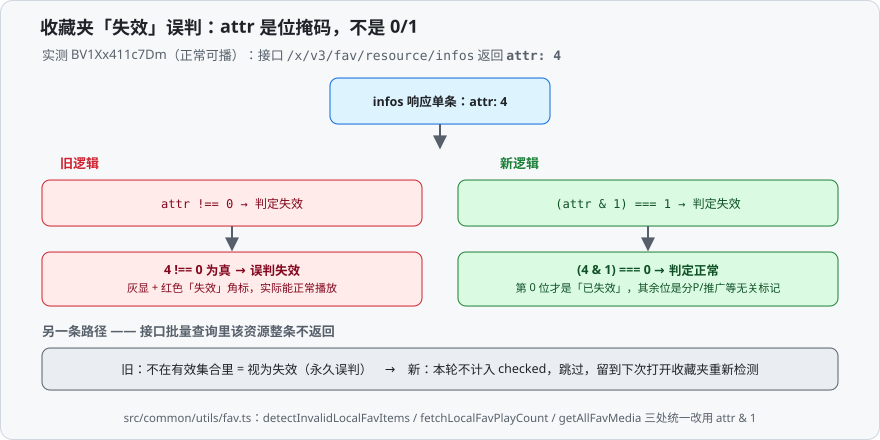

# 开发日志（DEVLOG）

> 这里是**入口和当月未归类记录**，不是全部历史。按专题或月份打开对应文件，避免每次任务都加载整部开发史。

## 写入规则

1. 每次提交前记一条：说明这个提交做了什么、效果是什么、关键数据流如何变化；不要复述 diff。
2. 可归入专题的记录写入 `docs/devlog/<年份>-<专题>.md`。同一专题同一年共用一个文件，记录用 `## 日期 type: 概述`，新的在上；跨年新建文件，不追加到旧年。
3. 纯文档、杂项等单次改动直接作为本文件的 `##` 记录。若后来形成明确专题，再把相关记录一起迁入专题文件。
4. 开始新月份时，将上个月留在本文件的单次记录移到 `docs/devlog/archive/YYYY-MM.md`；归档文件只追加、不回写。这样根文件最多保留一个月的单次记录。
5. 简单改动效果足以看懂，不必展开；复杂功能必须配图（数据流 / 架构），图片放 `docs/devlog-assets/` 并在对应专题或归档中引用。
6. 坑、失败尝试和反复权衡的设计决策不写开发日志，归入对应的 `docs/ideas/` 文件。

## 2026 专题日志

- [移动端](docs/devlog/2026-移动端.md)
- [Web 版](docs/devlog/2026-Web版.md)
- [播放时长与本地收藏](docs/devlog/2026-播放时长与本地收藏.md)
- [开发工具与性能](docs/devlog/2026-开发工具与性能.md)
- [本地歌单收藏](docs/devlog/2026-本地歌单收藏.md)
- [本地歌单云同步](docs/devlog/2026-本地歌单云同步.md)
- [快捷键焦点反馈](docs/devlog/2026-快捷键焦点反馈.md)
- [私人FM / 心动模式](docs/devlog/2026-私人FM.md)

## 当前未归类记录（2026-08）

## 2026-08-04 fix: 播放栏 / 歌单封面不同步

**效果**：

1. 合集里点一首歌，播放栏的标题和封面现在始终和你点的这首对得上。
2. 本地歌单封面（详情页头图、左侧栏缩略图）始终和歌单里最新收藏的那首歌封面一致，增删歌曲后会自动跟着换。

**关键代码**：

1. [`src/store/play-list.ts`](src/store/play-list.ts) `play()`：以前一首歌如果已经在播放队列里（比如之前在收藏夹改过名字），再从别处点它，只会切换播放，不会把新的标题/封面写回去，导致播放栏显示的还是旧的。现在复用队列里的曲目时，同步把标题封面刷新成这次点击的最新值。
2. [`src/common/utils/fav.ts`](src/common/utils/fav.ts) 新增 `getLocalFolderLatestCover`，取歌单里收藏时间最新那首歌的封面；[`local-favorites/index.tsx`](src/pages/video-collection/local-favorites/index.tsx) 的详情页头图、[`layout/side/collection/index.tsx`](src/layout/side/collection/index.tsx) 的左侧栏缩略图都改用这个实时值，不再读创建/迁移时写死的 `folder.cover`。

## 2026-08-04 fix: 部分歌曲「失效」误判



**效果**：本地收藏夹里部分实际正常可播的视频被错误打上「失效」角标（灰显 + 红框），例如 `BV1Xx411c7Dm` 在 B 站网页端能正常播放，App 里却显示失效。

**根因**：`/x/v3/fav/resource/infos` 的 `attr` 字段实测是**位掩码**，不是文档写的「0:正常 1:失效」二元值——直接查该接口拿到 `attr: 4`，第 0 位（`attr & 1`）是 0，视频本身完全正常；旧代码却按 `attr !== 0` 整体判定失效，把第 2 位这种无关标记（分P/推广等，含义未知）也当成了失效信号，一起误杀。另外接口对部分资源（尤其老视频）批量查询时可能整条不返回，旧代码把「不在有效集合里」直接等同「已失效」，把接口偶发缺席也算成了永久失效。

**关键代码**：

```ts
// src/common/utils/fav.ts —— detectInvalidLocalFavItems
// attr 是位掩码：仅第 0 位表示已失效，其余位是分P/推广等无关标记
const returnedKeys = new Set(infos.map(info => `${info.id}:${info.type}`));
const invalidKeys = new Set(infos.filter(info => (info.attr & 1) === 1).map(info => `${info.id}:${info.type}`));
for (const key of chunks[i]) {
  if (!returnedKeys.has(key)) continue; // 接口没返回：本轮不计入 checked，留到下次重新打开收藏夹再判
  for (const rid of resourceToRids.get(key) ?? []) {
    checked.add(rid);
    if (invalidKeys.has(key)) invalid.add(rid); // 只有明确返回且第 0 位为 1 才判失效
  }
}
```

`fetchLocalFavPlayCount`（单项播放量回查）、`getAllFavMedia`（在线收藏夹播放全部）两处同样把 `attr === 0` 的写法改成 `(attr & 1) === 0`，判断口径统一。`src/service/fav-resource-infos.ts` 里 `attr` 字段的过时注释也一并更正。之前被误标的本地数据不用手动改——下次打开对应收藏夹，后台重新检测会自动清除旧的错误 `invalid` 标记。

## 已归档的单次记录

- [2026-07](docs/devlog/archive/2026-07.md)
