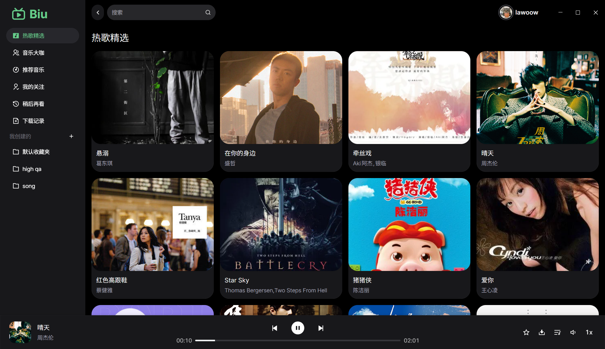
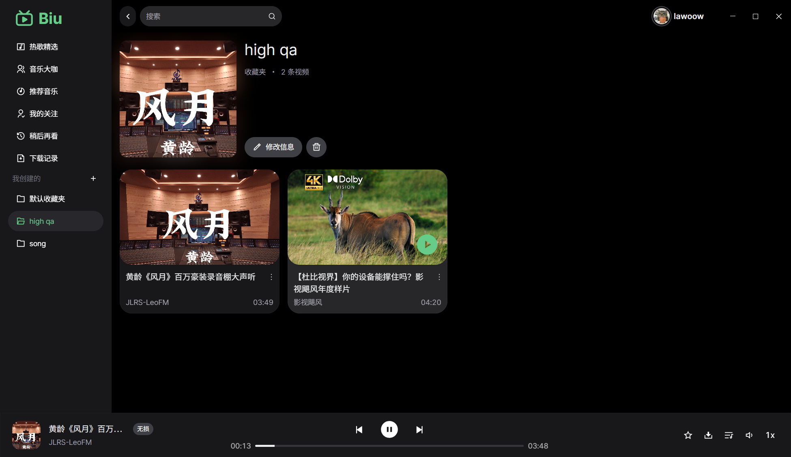
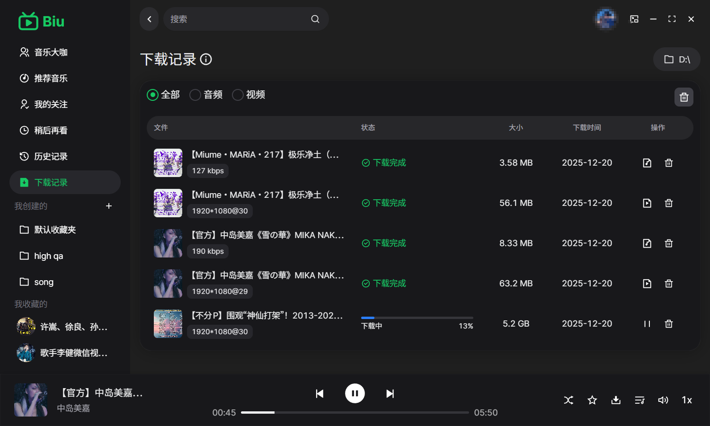
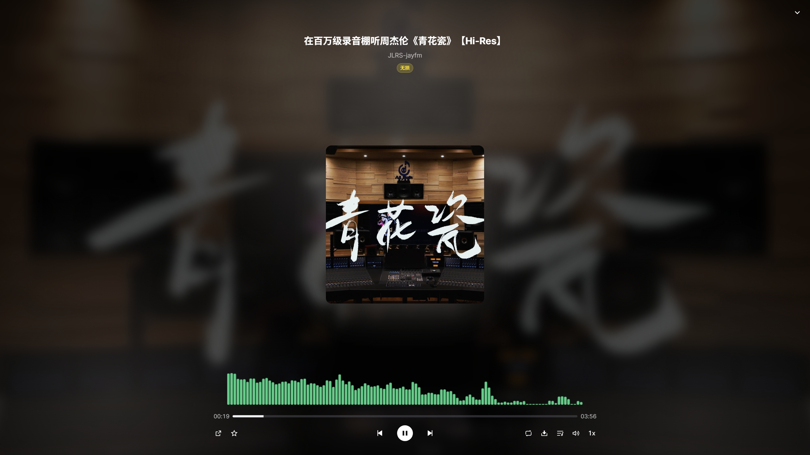
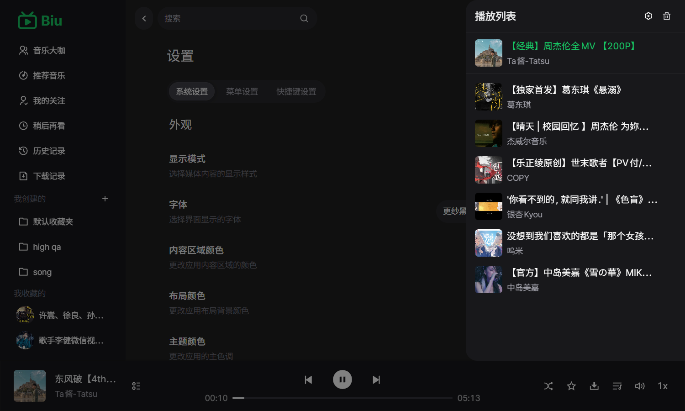
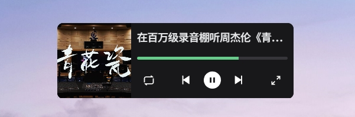

<h1 align="center">Biu 音乐播放器</h1>

  

  基于哔哩哔哩（B 站）公开接口的跨平台桌面音乐播放器 🎧🎶

  非官方项目，与哔哩哔哩无任何官方关联或背书

  
  

> **关于本仓库 / About this fork**
>
> 本项目是 [wood3n/biu](https://github.com/wood3n/biu) 的 Fork 与二次开发版本。上游仓库保持原有的桌面端定位；本仓库在其基础上继续扩展：
>
> - 🌐 **Web 版**：浏览器 / 手机端可用，含 iOS 分段流式播放与锁屏续播适配
> - 🎤 **歌词增强**：网易云 / LrcLib 歌词搜索与采用、桌面歌词
> - 🎵 **听歌识曲**（Shazam）与 **私人 FM / 心动模式**
> - ☁️ **同步服务**：`biu-sync-server`、`biu-lyrics-server`
>
> 原作者 [wood3n](https://github.com/wood3n) 及上游贡献者的版权与许可证（PolyForm Noncommercial 1.0.0）保持不变。需要原版桌面应用请前往[上游仓库](https://github.com/wood3n/biu)。

<table>
  <tr>
    <td width="50%" align="center">
      
    </td>
    <td width="50%" align="center">
      
    </td>
  </tr>
  <tr>
    <td width="50%" align="center">
      
    </td>
    <td width="50%" align="center">
      
    </td>
  </tr>
  <tr>
    <td width="50%" align="center">
      
    </td>
    <td width="50%" align="center">
      
 mini 播放器

      
    </td>
  </tr>
</table>

---

## ✨ 特色功能
- 🎼 支持登录 Bilibili 并获取收藏夹、稍后再看、历史记录等信息
- 🎧 高品质音频播放，优先拉取更高码率音频流（如无损 Flac，192K/Hi-Res）
- 🔥 支持视频文件以及提取视频中的音频下载；支持收藏夹视频批量下载
- 🧩 轻量界面，内置浅色和深色主题，同时可自定义部分主题样式，细腻的滚动与动效体验
- 💿 系统托盘与最小化隐藏，便捷控制播放
- 🍃 支持 mini 播放器模式，占用系统资源少，同时保留主窗口功能
- ♻️ 安装包支持自动检测更新，始终保持最新体验

## 下载和使用
- 下载页面：[biu.alcmaple.cn/biu](https://biu.alcmaple.cn/biu/)（安装包由自建服务器分发，不使用 GitHub Releases）
- 提供的安装包（`<version>` 为版本号）：

| 系统 | 安装包 | 文件名示例 | 说明 |
| --- | --- | --- | --- |
|  | 安装版（NSIS） | `Biu-<version>-win-setup-x64.exe` `Biu-<version>-win-setup-arm64.exe` | 一键安装/卸载，支持应用内自动更新；可能触发系统安全提示 |
|  | DMG | `Biu-<version>-mac-arm64.dmg` `Biu-<version>-mac-x64.dmg` | 拖入“应用程序”即可；首次打开可能需在系统设置中允许来源 |

- 架构怎么选
  - Windows：设置 → 系统 → 关于 → “系统类型”（ARM 设备选 `arm64`，其余多为 `x64`）
  - macOS：Apple 芯片选 `arm64`，Intel 芯片选 `x64`
- 自动更新说明
  - 应用会定期检查自建更新服务器，下载并安装新版本。
- 使用注意
  - 部分音频清晰度与解析可能需要登录或大会员权限。
  - 请遵循 Bilibili 使用条款，合理合规使用。

## 📄 许可证
本项目以 PolyForm Noncommercial License 1.0.0（非商业许可）发布，禁止任何商业用途。详情参见 [`LICENSE`](LICENSE)（SPDX：`PolyForm-Noncommercial-1.0.0`）。

---

如果你喜欢这个项目，欢迎 ⭐️ Star 支持！也欢迎提出 Issue 交流与反馈 🙌

## 🙏 鸣谢
- 特别感谢 [SocialSisterYi/bilibili-API-collect](https://github.com/SocialSisterYi/bilibili-API-collect) 对哔哩哔哩 API 的长期收集与整理，为本项目相关接口的使用提供了重要参考。
- 在引用与使用相关资料时，我们遵循其许可条款（`CC-BY-NC 4.0`），仅用于学习与研究，不涉及任何商业用途。

## ⚖️ 法律声明与使用限制
- 本项目仅供学习与研究使用，禁止任何形式的商业用途（包括但不限于销售、收费服务、广告变现、商业集成等）。
- 本项目与 Bilibili 无任何官方关联或背书，不使用其商标与标识；涉及的名称与商标归其权利人所有。
- 数据来源于用户调用的公开接口与个人账户授权；使用时需遵守 Bilibili 的《用户协议》《社区规则》及相关法律法规。
- 禁止绕过登录/会员权限、DRM/加密措施，或进行批量爬取、恶意抓取等违反平台规则的行为。
- 如需商业授权或调整许可，请联系作者；如涉及权利或合规问题，请通过 Issues 反馈以便及时处理。
---

## 🤝 贡献指南
非常欢迎社区贡献！你可以按以下流程参与：

1. Fork 本仓库并创建分支：`feature/your-feature` / `fix/your-fix`
2. 开发并通过本地构建与基本自测（如：`pnpm dev`、`pnpm build`）
3. 提交 PR，详述改动点与影响范围
4. 通过 CI 的构建与审查后合入主分支

建议：
- 使用 ESLint/Prettier 保持代码风格一致（ESLint/Prettier 已配置）
- 提交信息简洁规范（推荐使用 `feat: ...`、`fix: ...` 等约定式格式）
- PR 中附上必要的截图或说明

## ♥️ Contributors

感谢上游 [wood3n/biu](https://github.com/wood3n/biu) 的所有贡献者：

