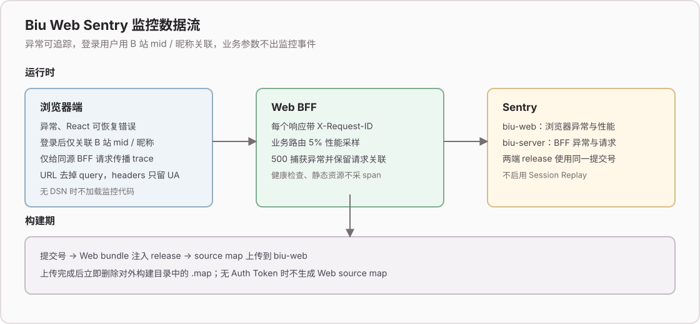
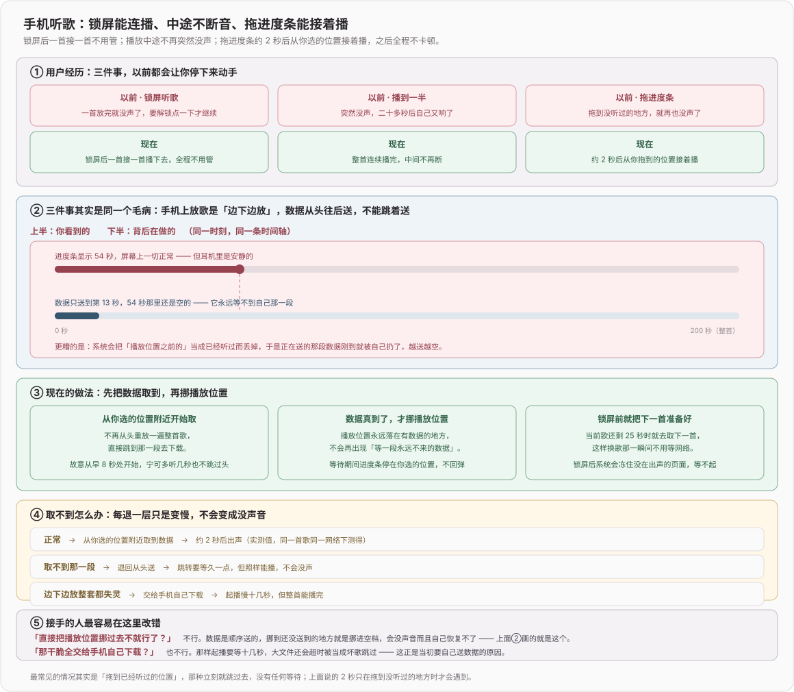
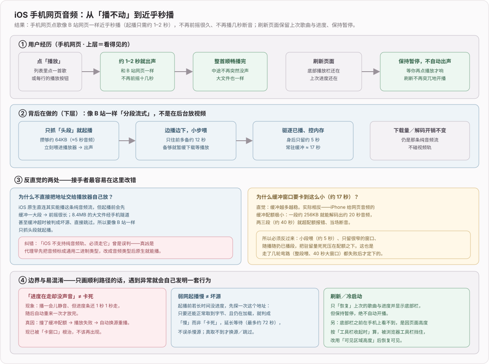
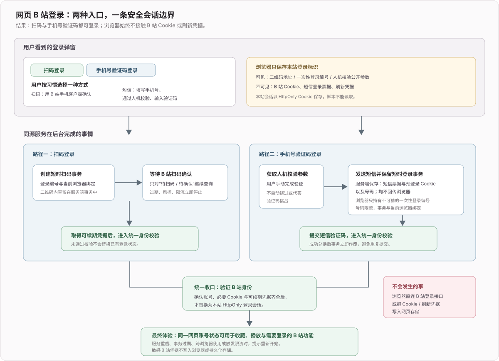
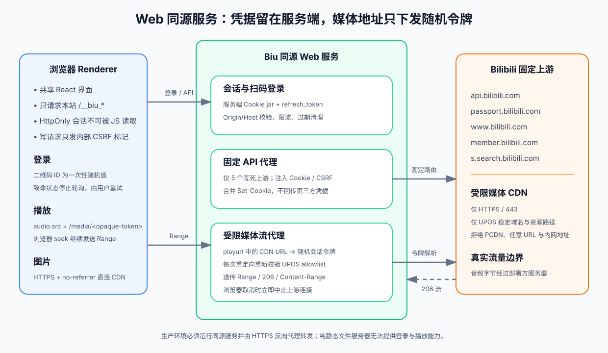
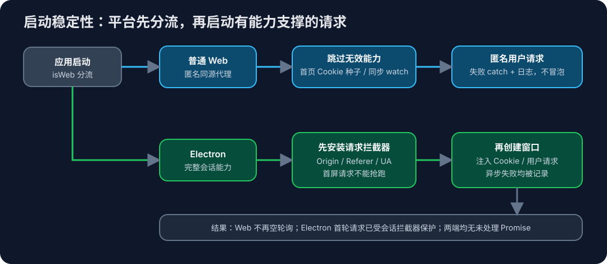
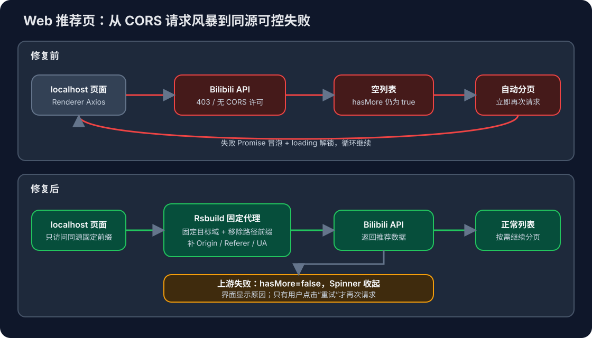
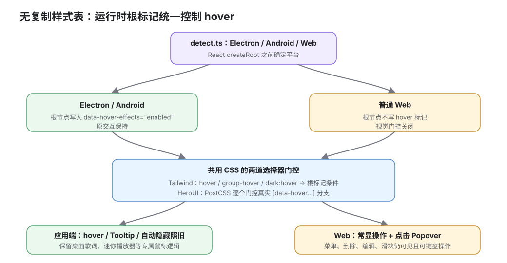
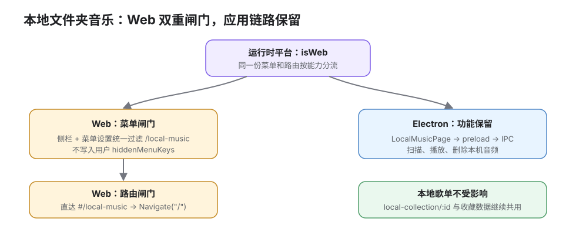
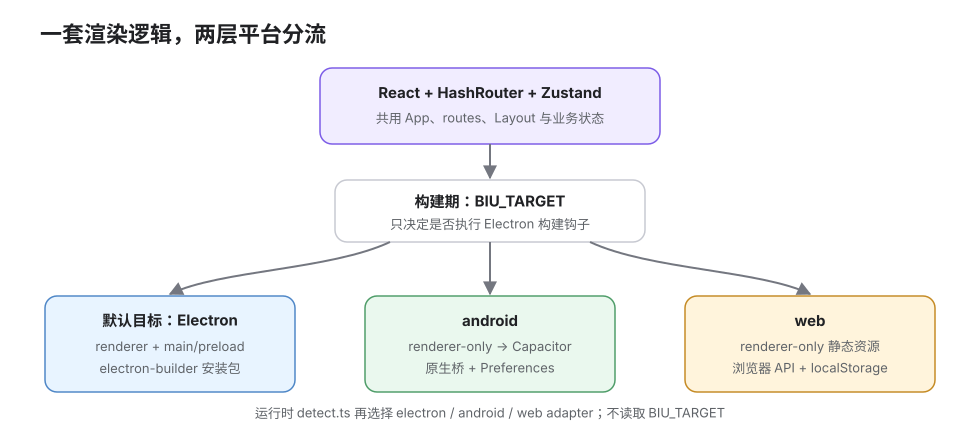

# Web 版

## 2026-09-05 fix(web): 修复陈旧标签页入口失效后白屏

**效果**：浏览器恢复旧标签页、请求已删除的带哈希入口时，服务端返回一次性恢复脚本，重新取得当前 HTML；保留查询参数和 hash 路由。正常入口仍使用长期缓存，其他缺失资源保持 404。

**关键链路**：`/static/js/index.<8位小写十六进制hash>.js` 文件不存在 → 返回 `200 + text/javascript + no-store` → 添加 `__biu_stale_entry=1` 并 `location.replace` → 当前 HTML（已有 `no-store`）→ 当前入口。守卫参数保留在 URL；同一地址恢复后再次失败不继续自动刷新，避免循环。仅接管 ENOENT，不掩盖权限错误、目录或越界软链。

**边界**：统计脚本改为 `async`，不加入延迟执行队列；实际构建中它原本排在应用入口之后，未将其认定为此次白屏根因。不改动移动滚动壳、播放状态、同步或原生端。入口文件存在但网络挂起、依赖 chunk 单独缺失等情况不在本次恢复条件内

## 2026-08-30 feat(web): 接入 Sentry 监控

**效果**：Web 浏览器异常、React 可恢复错误、BFF 未处理异常和低采样性能请求现在可以按同一提交号追踪；登录用户事件会显示 B 站 `mid` 和昵称，匿名事件保持无用户关联；没有 DSN 时浏览器不加载 Sentry SDK，Electron、Android、iOS 不受 Web 监控分支影响

**数据流**：浏览器端只给同源 `__biu_*` BFF 请求传播 trace；事件默认不采集自动 PII，登录态仅主动关联 B 站 `mid` 和昵称，查询串、Cookie、请求体和环境变量仍会去掉，headers 仅保留 `User-Agent`；Node BFF 为每个响应生成 `X-Request-ID`，业务路由按 5% 采样并在 500 时携带请求关联

**边界**：Sentry 项目分为 `biu-web` 与 `biu-server`，不启用 Session Replay；用户字段只保留已校验的 `mid`（`id`）和最多 128 个字符的昵称（`username`），手机号、邮箱、Cookie、请求体、查询串和 IP 不发送；source map 只有在构建机提供 `SENTRY_AUTH_TOKEN`、组织和 Web 项目后才上传，上传后立即从 `dist/web` 删除

## 2026-08-30 fix(web): 修复手机号粘贴带入国家区号

**效果**：在国家/地区选择器已显示 `+86` 时，手机浏览器粘贴 `+861382...` 或 `00861382...` 到手机号框，输入框只保留本地手机号；发送短信时不会再把国家区号重复传给 B 站

**数据流**：手机号输入和粘贴统一识别显式国际前缀后去除非数字字符；发送短信和原生端短信登录提交前再次按当前选中的国家/地区归一化，确保浏览器自动填充或组件事件绕过输入处理时仍符合 `cid + tel` 的接口约定

**边界**：只剥离带 `+` 或 `00` 的明确国际前缀，不改动本地号码本身；验证码字段原有的六位数字过滤和重复粘贴保护保持不变

## 2026-08-30 fix(web): 修复网页版无法搜索歌词

**效果**：Web 全屏播放器打开“搜索歌词”后，网易云和 LrcLib 的搜索按钮都会返回歌曲列表；点击 LrcLib 结果可以打开歌词预览并采用。Electron 端原有歌词搜索不变

**数据流**：浏览器通过同源歌词端点请求，Web BFF 只转发到写死的网易云和 LrcLib 上游，不转发浏览器 Cookie；返回内容限制为 JSON、10 秒超时和 2 MiB，避免把浏览器变成任意地址代理

**边界**：只接受三个固定的 GET 端点和白名单参数；跨站、重复或非法参数直接拒绝，上游失败仍由弹窗显示现有的搜索失败提示

## 2026-08-30 fix(web): 相同关键词可以重复搜索

**效果**：在搜索页再次按回车，或再次点击同一条搜索历史，视频/用户结果都会重新加载；不需要先换成别的关键词。输入过程中的内容不会触发额外搜索

**数据流**：每次用户明确提交关键词都递增一次页面内修订号；结果区域以修订号重新挂载，即使关键词文本没变也会重新请求。修订号不写入持久化，刷新页面仍按当前关键词正常加载

**边界**：只响应回车、建议项和搜索历史这三类明确提交，不把输入框每次变更都当成搜索请求

## 2026-08-30 fix(web): 修复弱网下搜索列表与搜索结果点播失败

**效果**：网络较慢或设备负载较高时，搜索失败会明确显示“搜索加载失败，请检查网络后重试”，用户可以手动重试；正常的零结果仍显示“暂无内容”。搜索结果点播与列表搜索共用页面内的 WBI 密钥，不再为每次请求重复等待导航信息

**数据流**：页面首次取得导航信息后，在内存保留 10 分钟的 WBI 密钥，并合并同时发生的导航读取；搜索或点播直接使用缓存签名，缓存失效且导航暂时失败时才借用最近一次成功的密钥。BFF 透传的业务错误不再被当成空列表，页面进入可重试状态

**边界**：B 站上游持续不可用时仍需用户手动重试，应用不做无限自动重试；密钥不写入持久化存储

## 2026-08-29 fix(web): 修复手机网页版短信验证码粘贴重复

**效果**：手机浏览器从短信或剪贴板填入验证码时，即使系统把同一串内容送入两次，输入框最终仍只保留一份六位数字，不会再因 12 位重复内容导致登录失败。

**关键改动**：

1. [`src/layout/navbar/login/code-login.tsx`](../../src/layout/navbar/login/code-login.tsx)：验证码输入统一过滤非数字并截断到 6 位；粘贴事件先阻止原生插入再写入一次，避免重复；补充 `inputMode="numeric"`、`autoComplete="one-time-code"` 和 `maxLength={6}`，兼容手机键盘自动填充。
2. [`tests/web-sms-code-login.test.tsx`](../../tests/web-sms-code-login.test.tsx)：加入移动端剪贴板重复验证码回归测试，确认最终值只有一份六位验证码并保留一次性验证码属性。

**验证**：短信登录相关 4 个测试文件 31 项通过；全量 Vitest 51 个测试文件 347 项通过，另有 1 个既有 `biu-sync-server` 测试因缺少 `dotenv` 依赖无法收集，与本改动无关。

## 2026-08-26 fix(player): 手机锁屏不续播、播到一半无声、拖进度条卡住

**效果**：

1. 锁屏后一首接一首播下去
2. 播放中途不再突然没声然后重新播放
3. 拖进度条或点击跳到没听过的位置，约 2 秒后从你选的位置接着播，之后全程不卡顿；等待期间进度条停在你选的位置，不会弹回原处。

**根因**：三个症状是同一个毛病。手机上放歌是「边下边放」，数据从文件头往后顺序送，中途**不能跳着送**。而播放位置是可以随便挪的——一旦挪到还没送到的地方，那里永远等不到自己那一段，就是没声音。更糟的是，喂数据的那套逻辑（备多少、丢多少、还能不能再喂）全都以「播放位置在已送到的范围内」为前提，这个前提一破，它们会反过来把正在送的数据当成已播过而丢掉，越送越空，最后彻底喂不进去。锁屏不续播则是另一种形式的同一问题：换歌那一刻才去取下一首的地址，而锁屏后系统会冻住没在出声的页面，这趟网络请求跑不完，播放就停在那里。

**关键代码**：

1. [`src/common/utils/media-source.ts`](../../src/common/utils/media-source.ts)：新增「从任意位置开始取数据」的能力。先读文件头解析出初始化段，再用「已知时长 × 文件总大小」估算目标位置的字节偏移，扫到最近的分片边界后用 HTTP Range 从那里拉流；故意从目标早 8 秒处起取，宁可多播几秒也不跳过头。配套是一条硬约束：**数据没覆盖到目标位置之前，绝不挪播放位置**——这条保证了播放位置永远落在已送到的范围内，喂数据那套逻辑的前提不会再被破坏。
2. [`src/store/play-list.ts`](../../src/store/play-list.ts) `seekAudioTo()`：所有定位统一走这一个入口。目标已经送到就直接挪，瞬时生效（拖进度条时绝大多数是这种）；没送到才带着目标重新取流。连续拖动会合并成一次取流，避免边拖边发请求。
3. [`src/store/play-list.ts`](../../src/store/play-list.ts) 预取：当前歌还剩 25 秒时就把下一首的地址取好写回队列，换歌那一刻不再需要等网络。随机模式下预取前会先把随机结果定下来，保证预取的就是真正会播的那一首。

## 2026-08-26 fix(player): 修复手机网页无法播放

**效果**：手机网页点歌像 B 站网页一样近乎秒播（起播只需约 1–2 秒），不再前摇十几秒、不再播几秒就断音跳过；刷新页面保留上次歌曲与播放进度、保持暂停不自动出声

**关键改动（按数据流）**：

1. **为什么仍要 MSE**：原生直连在 iOS 上起播前会先缓冲一大段 → 前摇很长；8.4MB 的大文件经手机隧道甚至缓冲超时被判成坏源直接跳过。B 站网页也用 MSE，就是为了只抓头部一小段就起播、其余边播边下 → 近乎秒播。[`src/common/utils/media-source.ts`](../../src/common/utils/media-source.ts) 复刻这套「分段喂 + 严格缓冲窗口 + 驱逐已播」的做法。它只下载音频轨、只做音频解码，**下载量和解码开销与直连完全一样，不涉及视频**。

2. **断音的根因是缓冲配额，不是“卡死”**：现象是播一会儿静音、进度条却还在 1 秒 1 秒走，随后自动换源重来一次才放完（约 3 首里有 1–2 首）。真因是 iPhone 的 `ManagedMediaSource` 给网页音频的 SourceBuffer 配额**极小**——一段约 256KB 就能解码出约 20 秒音频，两三段（约 40 秒）就 `QuotaExceededError`，当场断音、触发换源。修法与直觉相反：**缓冲越少越稳**。改成小段喂（约 64KB≈5 秒）、前向只备约 12 秒、身后只留约 5 秒（常驻缓冲 ≈ 17 秒），把驻留量死死压在配额之下；万一仍撞配额，逐级少留（8→4→2→1→0.5 秒）驱逐后重试。走过但被推翻的弯路：整段下载一次性喂（撞配额）、40 秒大窗口（撞配额）、依赖 `ManagedMediaSource` 的 `streaming`/`startstreaming`/`endstreaming` 流控（本机不能及时挡住配额，已删）。

3. **代理媒体响应统一发 `audio/mp4`**：[`web-server/proxy-common.ts`](../../web-server/proxy-common.ts) 对 media 流强制覆盖 B 站 CDN 的 `application/octet-stream`。这是第 0 步——没有它，iOS 连直连都进不去（`code 4`），也谈不上后面的 MSE。

4. **卡死看门狗改成“探测感知”**：起播前长时间无进度时，先对该地址探一次真实状态。只要还能正常取到字节（206）且元素仍在加载，就判成“慢”而非“卡死”，延长等待（最多约 6 轮≈72 秒），不误杀弱网慢源；真取不到才换源/跳过。MSE 首段喂入前 `buffered` 恒为 0，改用“已下载字节是否还在涨”作为存活信号。

5. **刷新不再自动播放**：[`play-list.ts`](../../src/store/play-list.ts) 冷启动恢复持久化的歌曲与进度后显式暂停（`init` 本身从不主动 `play()`，自动出声是媒体元素自恢复，这里兜底压住）。底部播放栏照常显示、进度保留，但保持暂停，等用户主动点播放。

6. **手机底部播放栏被 iOS 工具栏挡住**：[`src/app.css`](../../src/app.css) 里 `html/body/#root` 原用 `height:100%`，移动端取的是“动态工具栏收起时”的大视口，工具栏一出现就把底部栏挤出可见区。追加 `height:100dvh`（动态视口高度，跟随可见区域；桌面/Electron 无工具栏时等同 100%；老浏览器忽略回退 100%）。

## 2026-08-25 fix(player): 修复ios无法播放问题

**效果**：iPhone 网页（Chrome/Safari 内核相同，都是 WKWebView）现在能正常播放歌单里的歌。手机列表每行新增一个独立的播放/暂停按钮

**关键改动**：

1. 新增 [`src/common/utils/media-source.ts`](../../src/common/utils/media-source.ts)：iOS 上改用 `ManagedMediaSource`（iPhone 17.1+，iPad 用 `MediaSource`）把音频字节 `fetch` 下来逐段 `appendBuffer` 喂进 SourceBuffer——就是 B 站官方 iOS 的做法。只下载音频轨、只做音频解码，**不涉及视频**，运行时开销可忽略。MIME 按音质挑（AAC `mp4a.40.2` / 无损 `fLaC` / 杜比 `ec-3`），逐个 `isTypeSupported` 过滤。
2. [`play-list.ts`](../../src/store/play-list.ts) 所有在线音频源改走统一的 `setAudioSource()`：iOS 走 MSE、桌面/本地文件仍直连；MSE 失败自动回退直连，落进既有的换源/跳过链路。因为 MSE 下 `audio.src` 是 blob 对象地址，另存一份「逻辑地址」`currentSourceUrl` 供换源判重、失败自救比对使用。
3. seek 统一延到 `loadedmetadata` 之后执行（刚挂载时时长未知，提前写 `currentTime` 会被 WebKit 丢弃）。
4. [`music-list-item`](../../src/components/music-list-item/index.tsx) 手机端每行加播放/暂停按钮：当前行在播则暂停、否则播放，图标随状态变化。按钮用冒泡阶段 `stopPropagation`（含 `pointerdown`）挡住事件冒到整行，避免既播又暂停——之前误用捕获阶段导致按钮完全点不动。

## 2026-08-25 fix(player): 手机网页点歌无法播放、失败时换源请求风暴

**效果**：手机网页（iOS 上的 Chrome / Safari 内核相同）点歌单里的歌不再点了没反应。播放确实失败时，换源与跳歌都变成低频、有上限的重试，不会在几秒内把整张歌单的取址接口全部打一遍

**关键数据流**：

1. 换源自救链路（[`src/store/play-list.ts`](../../src/store/play-list.ts) `tryFailoverAudioSource`）加上节流三件套：两次换源最小间隔 2 秒、单曲最多换 3 次源（含一次重新取址）、等待期间用户已切歌就放弃抢占当前播放。
2. 自救失败后的跳歌连锁加退避：跳下一首前等 1.5 秒，连续失败上限从「整张列表长度」收紧到 3 首，超过就暂停并提示检查网络。几百首的歌单不再等同于无限往下跳。
3. `onerror` 与卡死看门狗按 `playId` 互斥，两者同时开火时只走一遍失败处理，请求量不再翻倍。
4. 网页版所有候选地址都由同一个同源代理会话签出 token，token 失效时逐个试候选必然全灭。现在检测到失败的是代理 URL 就跳过候选、直接重新取址。
5. `AbortError`（"The operation was aborted."）是换源时 `load()` 打断上一次 `play()` 产生的自身中断，不再当作播放失败弹出；同文案 toast 4 秒内去重。
6. `resumeAudioFrom` 改为等 `loadedmetadata` 再写 `currentTime`：刚 `load()` 完 duration 还是 NaN，此时 seek 在 iOS 的 WebKit 上会被丢弃甚至打断加载，反而让换源本身更容易失败。
7. 手机独有的失败根因：WebKit 只允许在用户手势里启动播放，而手势令牌在 `await` 网络请求后就失效。点歌 → `await getDashUrl()` → `audio.play()` 这条链路里 play() 已不在手势中，被拒为 `NotAllowedError`，旧代码还把它直接吞掉，表现就是「点了没反应也没提示」。现在 `play()` / `togglePlay()` 在任何 await 之前先同步调一次 `audio.load()`（WebKit 在手势中调 load() 会解除该元素的手势限制），NotAllowedError 也改为明确提示。桌面 Chrome 自动播放策略宽松，所以只在手机上暴露。
8. 手机没法开开发者工具，媒体元素的 `onerror` 又只给 code=2/3/4 的笼统分类。重新取址前会对失败地址发一个 1 字节 Range 请求探真实状态码，写进日志并提示（404 = 代理 token 失效、403 = 上游拒绝、0 = 网络不通），每首歌只探一次。

## 2026-08-24 fix(search): 未登录时隐藏用户搜索

**效果**：匿名搜索页只显示“视频”标签，不再暴露会触发账号相关请求的“用户”入口。登录后用户标签自动恢复；若用户正在浏览用户结果时退出登录，页面立即切回视频结果并卸载用户列表

## 2026-08-24 feat(web): 网页登录新增手机号验证码方式

**效果**：网页 B 站登录现在提供“扫码登录”和“手机号验证码登录”两个入口。手机号方式保留原有国家/地区、手机号、验证码输入与 60 秒倒计时体验

**关键数据流**：

1. 用户请求验证码时，同源服务先从 B 站获取人机校验参数；用户在浏览器中手动完成校验后，再由同源服务发送短信。B 站预登录 Cookie、短信登录票据、号码与地区码只保留在三分钟内的一次性服务端事务中，浏览器只拿到随机登录编号和本站 `HttpOnly` 绑定 Cookie
2. 用户提交六位短信验证码后，服务端携带该事务向 B 站登录；扫码和短信两条路径共用同一身份校验与会话签发步骤。只有账号、必要 Cookie 和可续期凭据都校验通过，才替换已有本站会话；`SESSDATA`、`bili_jct`、刷新凭据和短信票据不进入 renderer 或网页存储
3. 事务绑定创建它的浏览器；过期、跨浏览器使用或成功兑换后都必须重新开始。验证码发送按可信客户端地址和号码散列限流，登录尝试也有限流，避免把同源服务变成短信接口的放大入口

## 2026-08-15 build(web): 新增可部署同源服务

**效果**：

1. `pnpm build:web` 现在同时生成 renderer 的 `dist/web/` 与 Node 同源服务的 `dist/server/`；`pnpm start:web` 一次启动静态站点、健康检查、认证/API BFF 与媒体 Range 代理。
2. 静态服务阻止路径穿越、根目录外软链接和伪造的 BFF 路径；HTML 与 API 使用 `no-store`，带 hash 的静态资源使用长期 immutable 缓存。
3. `BIU_WEB_PUBLIC_ORIGIN` 在生产或非回环监听时强制配置，部署文档给出 HTTPS、反向代理、Range、缓存、客户端 IP 传递与进程内会话的完整边界。

**验证**：`pnpm build:web`、Web 服务 TypeScript 检查与生产静态服务测试通过。实测以 `BIU_WEB_PORT=5680 BIU_WEB_PUBLIC_ORIGIN=http://localhost:5680 pnpm start:web` 启动后，首页、匿名推荐封面、同源 API、`/__biu_health` 及音频 `206` Range 均正常。

## 2026-08-15 feat(web): 新增扫码登录与受限媒体代理

**效果**：

1. Web 登录改为服务端 TV 二维码事务：浏览器只拿二维码 URL、一次性登录 ID 和本站 `HttpOnly` 会话标识，`SESSDATA`、`bili_jct`、Gaia token 与 `refresh_token` 从不进入 renderer。
2. 二维码事务绑定发起它的浏览器，轮询只保留“未扫码 / 已扫码待确认”两种可继续状态；过期、限流、风控或未知失败立即停止。会话刷新按服务端 session 单飞，失败进入冷却，不会再形成刷新风暴。
3. Web playurl / 音频接口会把允许的 UPOS URL 改写为绑定匿名媒体会话的短期随机 token。浏览器只访问同源 `/__biu_proxy/bilibili/media/<token>`；代理透传 Range、206、Content-Range，并在浏览器取消时中止上游。
4. 登录态 API Cookie / CSRF 均由 BFF 按目标域、Path 与 host-only 范围选择和注入。Gaia 在匿名 Web 可无 CSRF，已登录 Web、Electron 与原生端仍保留原来的 CSRF 行为。

**关键数据流与边界**：

1. `/__biu_auth/qrcode` 创建服务端保存的 B 站 `auth_code`，另发随机 `__Host-biu_login` 绑定 Cookie；轮询成功后再次向 B 站校验身份，才旋转为 `__Host-biu_session`。服务重启会使内存会话失效，不落盘凭据。
2. 固定 API 代理只允许五个写死的 B 站 origin，禁止通用 passport 登录路径、浏览器 Cookie、第三方 `Set-Cookie` 与任意 target。写请求的 `X-Biu-Csrf` 只是内部指令，绝不转发上游。
3. 媒体 endpoint 不接收 URL 参数，UPOS allowlist 限制为 HTTPS/443 与资源路径；每次重定向重新验证，PCDN 和非媒体域名会在 playurl 改写时移除。客户端持久化播放队列会剥离进程级 token，重启后重新解析，避免反复尝试失效旧地址。

**验证**：认证、二维码、CSRF、Gaia、BFF、媒体、播放队列等 13 个聚焦测试文件共 92 项通过；真实匿名 Web 首次播放仅获得同源 opaque URL，`Range: bytes=0-` 返回 `206`。10 秒空闲观察没有 API 请求，12 张推荐封面均成功加载。

## 2026-08-15 fix(web): 修复匿名推荐封面空白

**效果**：

1. Web 匿名推荐列表不再整页显示图片占位符；B 站 `http://i*.hdslb.com` 封面统一升级为 HTTPS，并且不再携带 localhost 来源。
2. 封面加载失败只记录当前 URL；同一个列表项后续换成新封面时会重新加载，不会被旧错误状态永久锁在占位图。
3. 非 B 站图片和调用方显式传入的 `referrerPolicy` 保持原样，不扩大平台行为变化。

**验证证据**：

1. 修复前 Chrome 中同批封面返回 `403 / ERR_BLOCKED_BY_ORB`；修复后 13 / 13 个封面返回 `200 image/avif`，DOM 图片宽度均大于 0。
2. 图片组件失败时每个 URL 只发出一次请求，没有自动重试；6 秒观察期内 API 仍只有两次用户信息请求和一次推荐请求，封面问题不是请求风暴来源。

## 2026-08-15 fix(startup): 收敛多端启动请求错误

**效果**：

1. Web 匿名模式不再请求 B 站首页尝试种 Cookie，也不再启动依赖 `SESSDATA` 的本地歌单同步 watch；此前 2、5、15、30 秒的空重连计时器被彻底移除。
2. Renderer 的用户信息刷新和非 Web Cookie 初始化都接住异步错误并写入平台日志，不再以 `Uncaught (in promise)` 污染开发控制台。
3. Electron 在主窗口加载前先安装会话请求拦截器，首轮 `/nav` 等请求不会抢跑；Cookie 注入失败同样有明确日志。真实启动 20 秒未再出现首屏 Axios Network Error。

**关键启动顺序**：

1. `App` 和 `Layout` 先读取运行时 `isWeb`：Web 只保留可用的匿名用户请求，Electron 与 Capacitor 原生端继续执行 Cookie 初始化和同步通知通道。
2. Electron 主进程顺序改为 `installWebRequestInterceptors → createWindow → injectAuthCookie`；请求头修正已经生效后，Renderer 才能开始加载和发出网络请求。
3. 所有启动型 Promise 都以 `void …catch` 明确收口，错误被记录但不会触发自动刷新或无限重试；五项回归测试固定了平台分流、错误处理和主进程调用顺序。

## 2026-08-15 fix(web): 停止推荐失败后的请求风暴

**效果**：

1. 推荐接口失败后不再停留在无限转圈状态，也不会因空列表未填满视口而反复触发自动分页；页面会显示具体错误和“重新加载”按钮。
2. 加载更多失败时保留已经显示的内容、回退页码并关闭 `hasMore`；只有用户点击“重试加载更多”才会再次请求同一页，避免网络故障和限流被自动放大。
3. 网络错误、401 / 403、429 与 B 站业务错误分别给出可操作提示，成功重试后错误态自动清除并恢复列表。

**关键状态流**：

1. 首屏初始化先把 `hasMore` 置为 `false`，成功拿到完整一页后才由 `fetchPage` 重新开放分页；失败 Promise 在页面内捕获，清空 Spinner 并进入 `initial` 错误态。
2. 分页前记录旧页码；失败时恢复旧值并进入 `more` 错误态，手动重试用显式 `force` 越过关闭的 `hasMore`，仍请求原来的下一页。
3. 浏览器用 DevTools 阻断推荐接口后，3 秒和 8 秒观察到的失败请求数都保持为 1；解除阻断并点击“重新加载”后，错误提示消失且推荐列表恢复。

## 2026-08-15 fix(web): 通过同源代理恢复匿名推荐

**效果**：

1. `pnpm dev:web` 的音乐、鬼畜与流行推荐不再从浏览器直连 B 站域名；页面通过 localhost 同源地址取得匿名数据，首屏可以正常显示列表。
2. Web 的五组 Axios 实例统一映射到 `api`、`www`、`member`、`passport`、`search` 固定前缀；Electron、Android 与 iOS 仍访问原来的上游地址，不改变现有登录态链路。
3. 当前 Web 代理明确是匿名模式：浏览器 Cookie 不会转发，上游 `Set-Cookie` 也不会回传；Web 请求拦截器因此跳过无意义的 Cookie 刷新。

**关键代码与边界**：

1. `shared/bilibili-web-proxy.ts` 是客户端 baseURL 与服务端规则共用的唯一上游清单；每个前缀绑定一个写死的 B 站域名，没有动态 `target` 或 `router`，不能把它当成任意网址代理。
2. `plugins/bilibili-web-proxy.ts` 去掉同源前缀后原样保留 path、query 与请求体，并在服务端补齐 B 站所需的 `Origin`、`Referer` 与 `User-Agent`；敏感 Cookie 在双向链路上都被剥离。
3. 真实浏览器回归中，首屏 XHR 只访问 `http://localhost:5678/__biu_proxy/bilibili/...`，两个匿名 `/nav` 与一个推荐接口均返回 HTTP 200，直接访问 `*.bilibili.com` 的 XHR 为 0。

> 部署边界：Rsbuild 的代理只随开发 / 预览服务器运行。纯静态发布 `dist/web` 时，宿主服务器仍必须实现相同的五条固定反向代理；本提交不包含 Web 登录会话，也不包含音频 CDN 的 Range 流代理。

## 2026-08-15 fix(web): 显示开发服务器地址

**效果**：运行 `pnpm dev:web` 时，控制台会在启动时直接显示可访问的 Local 与 Network 地址，测试者无需再从配置文件猜测 5678 端口。Electron、Android 与 iOS 的既有开发输出保持不变。

**关键决策**：继续固定 5678 并保留 `strictPort`，只在 `BIU_TARGET=web` 时启用 Rsbuild 的 URL 输出；端口被占用仍立即失败，不会静默切换到另一个地址。

## 2026-08-15 feat(web): 移除悬停效果并保留操作入口

**效果**：

1. Web 中按钮、卡片、链接、封面、滚动条等元素在鼠标移入前后不再出现颜色、透明度、位移、缩放、自动显隐或提示气泡变化；键盘的 `focus-visible` 反馈不受影响。
2. 原先只在悬停时出现的播放列表菜单、删除标签/背景图、修改封面、进度拖块和排序方向在 Web 改为常显；倍速、音量、下载选项与随机播放设置改为点击打开。
3. Web 全屏播放器控件保持可见，侧栏保持展开且显示菜单文字；Electron 和 Android 仍启用原来的 Tailwind/HeroUI 悬停样式、Tooltip 与全屏自动隐藏行为。

**关键代码与数据流**：

1. React 挂载前只给非 Web 根节点写入 `data-hover-effects="enabled"`。Tailwind 的 `hover` custom variant 以及 PostCSS 对 HeroUI `[data-hover…]` 选择器的逐分支改写都依赖这一标记，因此三端仍共用一份 CSS，而不是复制 Web 样式表。
2. Web 不渲染提示型 Tooltip，也不写原生 DOM `title`；四个包含操作内容的 Tooltip 使用点击 Popover 替代。滚动条设为常显，全屏播放器的鼠标进入/移动处理不绑定，`mini-player` 与 `desktop-lyrics` 内部窗口路由直接回首页，避免 JS hover 绕过 CSS 门控。
3. 禁用视觉反馈前先补齐操作入口：隐藏菜单与删除按钮常显，封面编辑改成角标，列表在 Web 使用单击播放。功能入口与平台能力分流是显式 `isWeb` 分支，不影响 Electron 的双击与悬停逻辑。

## 2026-08-15 feat(web): 移除本地文件夹音乐功能

**效果**：

1. Web 侧栏和“菜单设置”不再出现“本地音乐”；这里仅指扫描本机文件夹的功能，本地歌单、收藏弹窗和 `local-collection/:id` 完整保留。
2. 旧书签或手动输入 `#/local-music` 会直接回到首页，页面不会挂载，也不会触发目录扫描。
3. Electron 的本地音乐页面、设置目录、preload 与主进程 IPC 均未删除，应用版行为不变。

**关键代码与数据流**：

1. `DefaultMenuList` 给本地音乐标记 `hideOnWeb`，`getDefaultMenuList(isWeb)` 成为侧栏和菜单设置共同使用的平台过滤入口，避免两处各写一套名单。
2. `createRoutes(isWeb)` 在 Web 把 `local-music` 元素替换为回首页的 `Navigate`；菜单隐藏负责正常入口，路由闸门负责历史记录和直接地址。
3. 平台限制不写进用户的 `hiddenMenuKeys`，防止退出登录清空设置后把 Web 不支持的功能重新放出来。

## 2026-08-15 feat(web): 新增共享界面的网页构建

**效果**：

1. 新增 `pnpm dev:web` 与 `pnpm build:web`，普通网页开发和构建只处理现有 React 渲染层，不再启动 Electron 或生成安装包。
2. Web 继续使用应用现有的 `App → routes → Layout` 主界面；普通浏览器不再被误判为 Android，也不会显示 Electron 的窗口控制按钮。
3. Electron、原生 Android、普通 Web 分别选择自己的平台适配；Web 的设置、本地歌单等共享持久化状态保存到当前站点的浏览器存储。

**关键代码与数据流**：

1. `plugins/rsbuild-plugin-electron.ts` 只在默认目标执行 main/preload 编译和 electron-builder；`BIU_TARGET=android|web` 都是 renderer-only 构建目标。
2. `src/platform/detect.ts` 先识别 Electron，再确认 Capacitor Android 原生桥，剩余环境才归为 Web；`src/platform/index.ts` 据此选择三套 adapter。
3. `src/platform/web.ts` 沿用 `platform.getStore/setStore/clearStore` 契约，把数据序列化到 `biu:<StoreName>`，因此 Zustand store 不需要另写 Web 分支。

> 边界：本提交建立可部署的共享 Web 前端与平台能力分流。浏览器无法伪造 Bilibili 请求头、跨域读写其 Cookie；需要登录态或受限媒体直连的功能仍需后续同源服务端方案，不能用“构建成功”冒充可播放验证。
