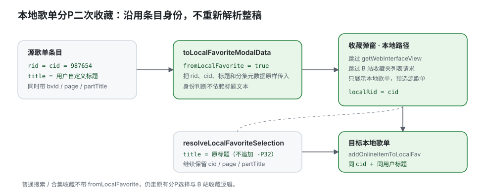

# 本地歌单收藏（2026）

> 专题开发日志。新记录在上；记录规则和总入口见 [`DEVLOG.md`](../../DEVLOG.md)。

## 2026-08-07 fix(favorite): 本地歌单分P二次收藏沿用原条目

**效果**：

1. 从本地歌单条目的“移动”菜单再次收藏时，直接进入本地歌单选择，不再弹出整稿分P列表；源歌单会按当前条目状态预选。
2. 分P条目使用已保存的 `rid/cid` 做身份匹配，不依赖歌名；复制到另一个本地歌单时保留用户已经修改过的标题、分集序号、分集标题和时长，不再自动追加 `-P32`。
3. 搜索、合集、播放栏等全网收藏入口不带本地来源标记，仍保留原来的 B 站分P选择和在线收藏逻辑。

**关键数据流**：

1. [`src/common/utils/fav.ts`](../../src/common/utils/fav.ts) 的 `toLocalFavoriteModalData` 将本地条目的 `rid/cid/title/page/partTitle` 与 `fromLocalFavorite` 一起传给弹窗；`source` 同时补齐，避免本地文件二次收藏丢失播放来源。
2. [`src/components/favorites-select-modal/index.tsx`](../../src/components/favorites-select-modal/index.tsx) 看到 `fromLocalFavorite` 后跳过 `getWebInterfaceView` 和 B 站收藏夹列表请求，只计算本地歌单的选中状态；`resolveLocalFavoriteSelection` 以原 cid 为 `localRid`，直接使用原标题。
3. [`src/pages/video-collection/local-favorites/index.tsx`](../../src/pages/video-collection/local-favorites/index.tsx) 的“移动”入口统一走上述本地数据转换；目标歌单仍通过 `addOnlineItemToLocalFav` 入库，因此与普通收藏共享持久化、标签和播放量补全路径。

**验证**：新增 [`tests/local-fav-duplicate.test.ts`](../../tests/local-fav-duplicate.test.ts) 覆盖分P身份/标题保留及普通整稿收藏不误带 cid 两条边界。
