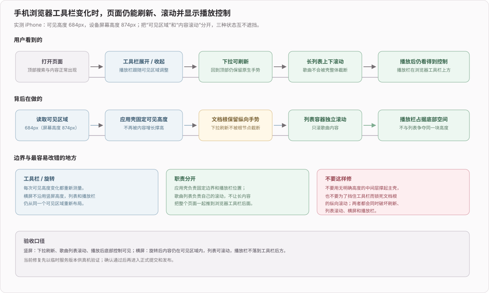
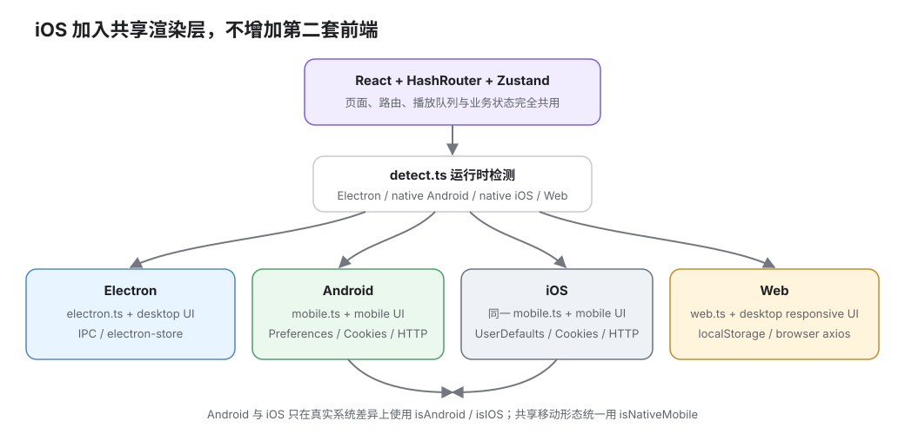
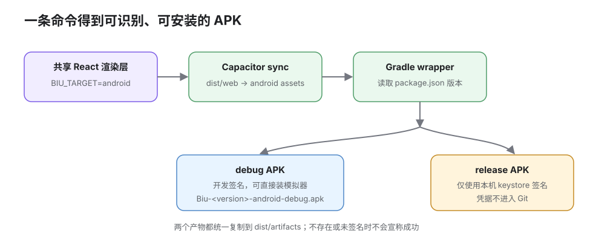

# 移动端

## 2026-08-29 fix(mobile): 修复 iOS 浏览器视口链路导致的页面整体不可用

**效果**：

1. iOS 浏览器底部工具栏展开、收起或旋转时，播放栏始终留在可见区域内，不再被浏览器工具栏遮住
2. 下拉刷新恢复，歌曲列表可以独立上下滚动，长列表不会把整个页面和播放栏一起推出视口
3. 竖屏、横屏共用同一套页面结构；搜索、收藏夹内容、列表和播放控制在两种方向下都保持可见

## 2026-08-28 fix(mobile): 完善页面响应式

**效果**：

1. 手机收藏夹头图、操作栏、失效内容入口和搜索/排序控件改为窄屏布局；第一行保留“播放全部 / 更多”，第二行完整显示标签和搜索，手机隐藏“添加到播放列表”，失效内容放入更多菜单
2. 历史记录、稍后再看、下载、本地音乐、关注、动态、用户空间、设置和全屏播放器的窄屏结构不再固定占用桌面列宽；下载记录在手机端改为卡片信息块
3. 歌曲行、播放列表和分集菜单的触屏点击不再误触发行播放；收藏、下一首播放、加入播放列表会给出即时提示，本地收藏夹的失效内容入口在手机端收进更多菜单
4. 根容器继续以 `visualViewport` 实测高度布局，并补上窗口 resize / viewport scroll 监听，动态工具栏变化时底部播放栏保持可见

## 2026-08-15 docs(mobile): 补全无真机模拟器调试流程

**效果**：

1. Android 文档改为以 CLI 模拟器为主线，明确区分渲染构建、Capacitor sync、可安装 debug APK 与已签名 release APK；移除已过时的手改 Gradle 和错误产物路径。
2. 新增 iOS 调试与发布文档，覆盖 Simulator、Live Reload 的 ATS 前置条件、Safari / 原生网络观测边界、Xcode Archive、build number、Personal Team 与 TestFlight / IPA 分发边界，并说明当前 Mac 为何无法运行 Xcode 26。
3. 两端都把“容器或模拟器能启动”与“真机功能已验证”分开，列出 Cookie / CDN 播放、后台音频、锁屏、耳机键、麦克风、功耗等仍必须真机验收的项目。

## 2026-08-15 fix(mobile): 固定实时调试端口

**效果**：Android / iOS Live Reload 固定使用 5678。端口已被占用时 Rsbuild 会立即报错退出，不再静默换到其他端口、却让 Capacitor / `adb reverse` 继续连 5678，导致模拟器白屏。

**关键决策**：`rsbuild.config.ts` 的 `server.strictPort` 改为 `true`。开发端口是桌面开发、Capacitor Live Reload 和端口转发之间的共同协议，因此选择及时失败，而不是在某一端猜测新端口。

## 2026-08-15 fix(android): 确保 APK 始终使用离线资源

**效果**：

1. `build:android:apk` 和 `build:android:apk:release` 不再继承终端里残留的 `BIU_DEV_URL`；即使之前跑过 Live Reload，打出的 APK 也只会加载包内 `public` 资源，不会变成依赖开发服务器的空壳。
2. APK 的 Node 入口直接为 Rsbuild 设置 `BIU_TARGET=android`，再调用 Capacitor sync；不再绕回包含 POSIX 环境变量语法的 package script，macOS、Linux 与 Windows 都走同一条 Node 流程。

**关键代码与数据流**：

1. `scripts/build-android-apk.mjs` 克隆当前环境后显式删除 `BIU_DEV_URL`、注入 `BIU_TARGET=android`，依次执行 `pnpm exec rsbuild build` 和 `pnpm exec cap sync android`。
2. 同一份已清洗环境继续传给 Gradle；产物复制逻辑和 debug / release 签名边界不变。

## 2026-08-15 feat(ios): 新增共享移动界面的 iOS 端

**效果**：

1. 新增 Capacitor 8.3.1 Swift Package Manager iOS 工程，以及 `dev:ios`、`build:ios`、`open:ios`、`run:ios` 命令；iOS 不复制页面或状态逻辑，继续使用现有 React 路由树。
2. 原生 iOS 不再被误判成 Web：它与 Android 共用 Preferences、Cookies、CapacitorHttp、移动顶栏/抽屉/播放栏/设置页，并增加刘海、状态栏和 Home Indicator 安全区适配。
3. iOS 工程包含 Biu 图标与启动图、Preferences 所需的 Apple Privacy Manifest；版本名和构建号在每次 iOS 构建前从 `package.json` 同步。

**关键代码与数据流**：

1. `detect.ts` 先确认 Capacitor 原生桥，再区分 `isAndroid` / `isIOS` 并汇总为 `isNativeMobile`。`platform/index.ts` 据此选择共享 `mobile.ts` 与 `http-native.ts`；普通移动浏览器仍属于 Web。
2. 原 Android 专用 adapter 已收敛为移动端 adapter：iOS 的 Zustand 持久化落到 UserDefaults，登录 Cookie 走原生 Cookie API，axios 请求走 CapacitorHttp；桌面窗口、下载、全局快捷键等仍保持明确 noop。
3. `BIU_TARGET=ios` 只让 Rsbuild 跳过 Electron main/preload 与 electron-builder；产物仍写 `dist/web`，随后 `cap sync ios` 复制进 Xcode 工程。Xcode 的 SPM 依赖和隐私声明属于原生容器，不进入共享业务层。

> 验证边界：`pnpm build:ios`、Capacitor sync、平台检测/Preferences/Cookies/HTTP 单测已通过。当前 Mac 是 macOS 14.3 且没有完整 Xcode；Capacitor 8 至少要求 Xcode 26.0，而 Apple 当前矩阵中的 Xcode 26.0–26.3 支持 macOS Sequoia 15.6 至 Tahoe 26.x、Xcode 26.4.1–26.6 只支持 macOS Tahoe 26.2–26.x，所以本提交不能声称 iOS 原生编译、Simulator、登录 Cookie、媒体 CDN 播放或后台音频已经实机验证。

## 2026-08-15 build(android): 新增可直接安装的 APK 构建

**效果**：

1. `pnpm build:android:apk` 一条命令完成共享界面构建、Capacitor 同步和 Gradle debug 打包，产物统一复制到 `dist/artifacts/Biu-<版本>-android-debug.apk`，可直接装进模拟器或测试设备。
2. `pnpm build:android:apk:release` 使用本机 `android/keystore.properties` 生成签名 release APK；缺少签名文件时在构建前明确停止，不会把 unsigned 包误当成发布包。
3. Android 的 `versionName` 直接读取 `package.json`，`versionCode` 由 SemVer 计算；当前 2.5.3 APK 不再错误显示为 1.0。签名文件和密码配置全部保持在 Git 之外。

**关键代码与数据流**：

1. `scripts/build-android-apk.mjs` 是跨 macOS / Linux / Windows 的单一入口：先调用现有 `build:android`，再选择 Gradle wrapper 的 debug 或 release task，最后核对并复制真实 APK。
2. `android/app/build.gradle` 在配置期读取根 `package.json`。稳定版使用最高渠道序号；alpha、beta、rc 使用更低序号，使同一版本的预发布包可以顺序升级到稳定版。
3. release 签名只有在 `keystore.properties` 存在且四个必填字段完整时才挂到 Gradle；仓库仅保存读取逻辑，不保存 keystore、别名或密码。
